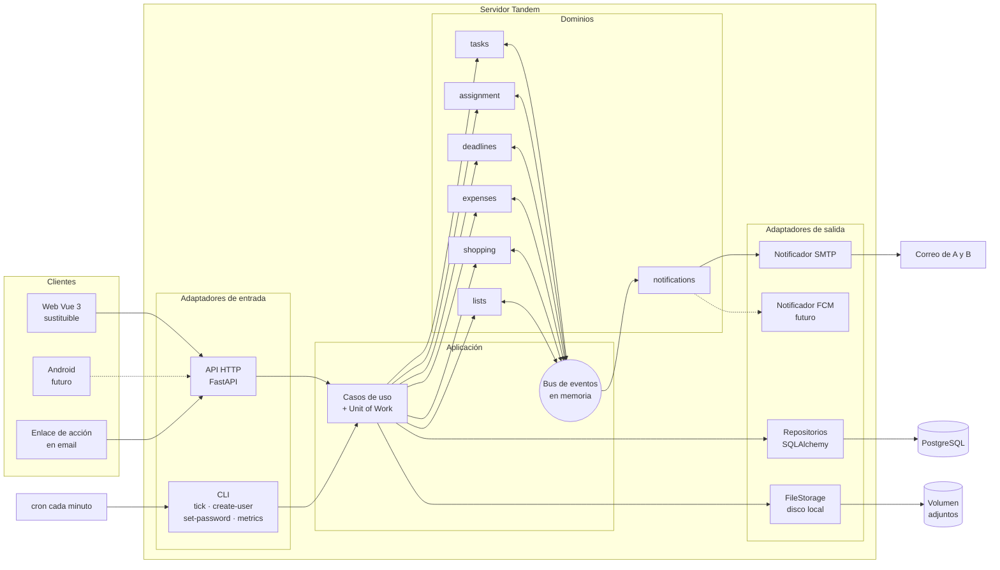
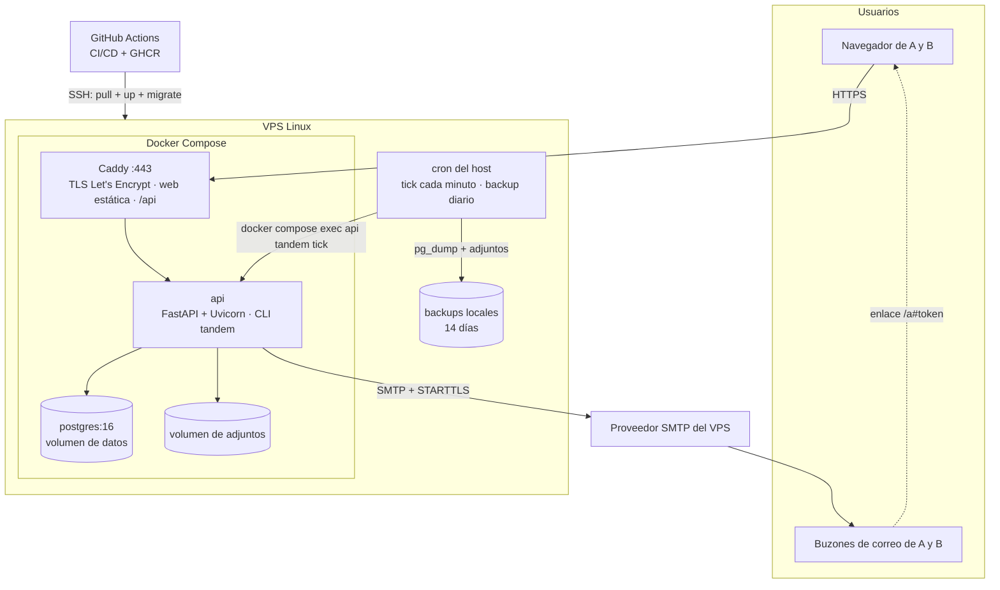

# Tandem

> El sistema operativo de un hogar de dos personas: tareas, citas, gastos, compra y listas en un solo sitio, con avisos que llegan **a los dos**.

📄 Documentación complementaria: [PRD](docs/PRD.md) (producto y requisitos) · [Backlog de historias](docs/USER_STORIES.md) · [Backlog de tickets](docs/TICKETS.md) · [Glosario](docs/PRD.md#14-glosario) · [Prompts](prompts.md)

## Índice

0. [Ficha del proyecto](#0-ficha-del-proyecto)
1. [Descripción general del producto](#1-descripción-general-del-producto)
2. [Arquitectura del sistema](#2-arquitectura-del-sistema)
3. [Modelo de datos](#3-modelo-de-datos)
4. [Especificación de la API](#4-especificación-de-la-api)
5. [Historias de usuario](#5-historias-de-usuario)
6. [Tickets de trabajo](#6-tickets-de-trabajo)
7. [Pull requests](#7-pull-requests)

---

## 0. Ficha del proyecto

### **0.1. Tu nombre completo:**

Manuel Gómez Fernández

### **0.2. Nombre del proyecto:**

Tandem

### **0.3. Descripción breve del proyecto:**

Aplicación para gestionar el hogar entre las dos personas de una pareja conviviente: tareas recurrentes con rotación, citas y vencimientos, gastos compartidos, lista de la compra y listas de interés. A diferencia de las apps actuales, Tandem **empuja avisos por correo a ambos miembros** (con acciones de un clic) para que la carga mental de acordarse no recaiga siempre en la misma persona. Backend en Python/FastAPI con arquitectura hexagonal y eventos de dominio, PostgreSQL, web mínima en Vue y despliegue en VPS.

### **0.4. URL del proyecto:**

Pendiente. Se publicará en un VPS propio con HTTPS en la entrega 2 (despliegue mínimo) y quedará completo en la entrega final.

### 0.5. URL o archivo comprimido del repositorio

https://github.com/lologf/AI4Devs-finalproject

[↑ Índice](#índice)

---

## 1. Descripción general del producto

### **1.1. Objetivo:**

**Problema.**
1. **Fragmentación**: tareas en una app, gastos en Splitwise, compra en Google Keep, citas en el calendario, pelis pendientes en notas. No hay una visión conjunta del hogar.
2. **Ninguna empuja**: las apps actuales son pasivas; hay que acordarse de mirarlas. Quien se acuerda acaba recordándoselo al otro.
3. **Carga mental asimétrica**: la persona que "lleva la cabeza" del hogar asume un trabajo invisible (planificar, recordar, perseguir) que no se refleja en ningún sitio.

**Propuesta de valor.** *"Que el sistema se acuerde por los dos."*
- Un solo lugar para todo lo compartido del hogar.
- El sistema **recuerda y avisa a ambos** (con antelación, por email) en lugar de que lo haga una persona.
- La asignación es **explícita y visible** (a quién le toca, rotaciones, balance), de modo que el reparto deja de depender de la memoria de nadie.
- Los avisos **permiten actuar** (marcar hecho, posponer, asumir) sin abrir la app.

**Para quién.** Exactamente dos usuarios: una pareja que convive, en la que ambos trabajan y que se conoce de antemano. No es multiusuario ni multihogar, y es una restricción **deliberada** ([principio 1 del PRD](docs/PRD.md#6-principios-de-diseño)) que permite centrar el esfuerzo en el valor: avisos y reparto. No es un producto comercial. Perfiles, supuestos y escenario de uso: [PRD §3](docs/PRD.md#3-usuarios).

### **1.2. Características y funcionalidades principales:**

| Dominio | Funcionalidades | Prioridad |
|---|---|---|
| **Acceso** (`auth`) | Login con sesión, gestión de sesiones (cerrar una concreta o todas), cambio de contraseña, perfil (nombre, email de avisos confirmado por correo, preferencias de aviso); identidad del actor en cada acción. Alta de los dos miembros y restablecimiento de contraseña por CLI | Must (cambio de contraseña, nombre y email: Should) |
| **Tareas** (`tasks`) | Tareas puntuales o recurrentes (por calendario o "cada N días tras hacerla"), ocurrencias, atrasadas, historial, vistas "Hoy" y "Esta semana" (con las citas y vencimientos del periodo) | Must (historial: Should) |
| **Asignación** (`assignment`) | Fija / alterna / cualquiera, ausencias con reasignación automática, "me lo quedo", balance por miembro (quién hace y quién planifica) | Must (cambiar o cancelar ausencias: Should) |
| **Citas y vencimientos** (`deadlines`) | ITV, seguros, médicos… con antelaciones configurables, vencimientos de día completo, renovación anual y **adjuntos** (billetes, reservas, entradas) | Must (atrasados diarios y adjuntos: Should) |
| **Notificaciones** (`notifications`) | Avisos inmediatos + digest (resumen diario por correo) opcional, ventana de silencio, agrupación, posponer, idempotencia, reintentos; entrega por correo (SMTP) | Must (reintentos y estado de los fallos: Should) |
| **Motor temporal** (`scheduler`) | Tick cada minuto que aplica los cambios de estado por tiempo (atrasos, citas pasadas), genera los gastos recurrentes y el digest y entrega los avisos ya programados; alerta si deja de ejecutarse | Must |
| **Acciones desde el correo** | Enlaces de un solo uso para marcar hecho, omitir, posponer, asumir o resolver | Must |
| **Gastos** (`expenses`) | Gastos con reparto por %, saldo neto, liquidación, recurrentes, categorías editables | Should (listado por mes y categorías: Could) |
| **Compra** (`shopping`) | Lista compartida por secciones ordenables, cierre de compra que genera el gasto | Could |
| **Listas** (`lists`) | Listas temáticas (pelis, bares, viajes) con valoración | Could |
| **Operación** | Métricas de éxito (`tandem metrics`) | Should |

**MVP comprometido**: todo lo Must y Should. Lo Could (compra, listas y algunas vistas) se implementa en la entrega 3 si el plan lo permite. La prioridad (MoSCoW) fija también el orden de implementación. Requisitos funcionales detallados, principios de diseño y fuera de alcance: [PRD §5–§7](docs/PRD.md#5-alcance).

### **1.3. Diseño y experiencia de usuario:**

> Se completará con capturas y un vídeo en las entregas 2 y 3.

Mapa de pantallas previsto (web *mobile first*, en español):

```text
Login ──► Hoy / Esta semana (ocurrencias, citas y vencimientos de ambos; atrasadas primero; filtro "solo las mías")
          ├── Tareas ─── detalle (historial, regla de asignación) ─── crear/editar
          ├── Citas y vencimientos ─── detalle (antelaciones, adjuntos)
          ├── Gastos ─── saldo · liquidar · listado por mes · recurrentes
          ├── Compra ─── lista por secciones · cerrar compra
          ├── Listas ─── lista temática ─── elementos
          ├── Balance ─── reparto de tareas por periodo
          └── Perfil ─── nombre, email de avisos, silencio, digest, sesiones, contraseña, reparto por defecto, categorías

Correo de aviso ──► /a#token ──► confirmación ──► resultado   (sin login)
```

### **1.4. Instrucciones de instalación:**

> Instrucciones previstas; se validarán en la entrega 2, cuando exista el código.

**Requisitos**: Docker y Docker Compose; Node 20+ solo para desarrollar el frontend.

```bash
git clone https://github.com/lologf/AI4Devs-finalproject.git tandem && cd tandem
cp .env.example .env                        # secretos, SMTP, dominio
docker compose up -d                        # api, db (Postgres 16), mailpit (SMTP de pruebas)
docker compose exec api alembic upgrade head
docker compose exec api tandem create-user --email lucia@example.com --name Lucía
docker compose exec api tandem create-user --email alex@example.com --name Álex
docker compose exec api tandem seed-demo    # opcional: datos de ejemplo

# Frontend en modo desarrollo
cd frontend && npm ci && npm run gen:api && npm run dev   # http://localhost:5173

# Motor temporal (en desarrollo, a mano o con watch)
docker compose exec api tandem tick
```

Los correos de desarrollo se ven en Mailpit: http://localhost:8025.

[↑ Índice](#índice)

---

## 2. Arquitectura del Sistema

### **2.1. Diagrama de arquitectura:**



**Patrón: arquitectura hexagonal (puertos y adaptadores) + eventos de dominio sobre un bus en memoria, en un monolito modular.**

- **Dominios** (`tasks`, `assignment`, `deadlines`, `expenses`, `shopping`, `lists`, `notifications`): lógica pura, sin FastAPI, SQLAlchemy ni SMTP. Dependen solo de **puertos** (interfaces) como `TaskRepository`, `Clock`, `Notifier` o `FileStorage`.
- **Los dominios no se llaman entre sí**: emiten eventos (`OccurrenceCompleted`, `ShoppingCompleted`…) y reaccionan a otros. Cada dominio declara en su `SPEC.md` qué emite y a qué reacciona: es un **contrato explícito** que permite probar cada dominio aislado.
- **Adaptadores de entrada**: API HTTP (FastAPI) y CLI (`tick`, `create-user`, `set-password`, `metrics`, `seed-demo`).
- **Adaptadores de salida**: repositorios Postgres, notificador SMTP (en el futuro, FCM), almacenamiento de ficheros.
- **Motor temporal**: un cron ejecuta `tandem tick` cada minuto; el tick publica `ClockTicked`, cada dominio decide qué le toca, y después entrega los avisos cuyo momento ha llegado.
- **Outbox**: las notificaciones se guardan en BD en la misma transacción que el cambio que las provoca y se entregan después, así que un fallo de SMTP nunca pierde un aviso.

**Por qué esta arquitectura**

| Beneficio | Cómo se consigue |
|---|---|
| El cliente es sustituible | La API (OpenAPI) es el contrato estable; la web del MVP es mínima a propósito y, como la futura app Android, es solo un adaptador que se sustituye sin tocar el núcleo |
| Cambiar de canal sin tocar el núcleo | `notifications` decide *qué, a quién y cuándo*; el adaptador (SMTP → FCM) decide *cómo* |
| Dominios testeables en aislamiento | Sin dependencias de infraestructura, con reloj inyectable (`Clock`) |
| Disciplina de límites sin coste de infraestructura | Bus en memoria en un único proceso: sin colas, brokers ni microservicios |
| Consistencia | Handlers síncronos dentro de la misma transacción (Unit of Work) |

**Sacrificios y déficits**

- **Más ceremonia** que un CRUD directo (puertos, eventos, casos de uso) para un producto de dos usuarios. Se asume por su valor didáctico y de evolución.
- **El bus en memoria no escala horizontalmente** ni sobrevive a caídas a mitad de transacción (se mitiga con la transacción única y el outbox). Si algún día hiciera falta, se sustituiría por un broker sin tocar los dominios.
- **Acoplamiento de esquema**: hay FK entre tablas de dominios distintos (ADR-11). Atan el esquema a una sola BD: separar un dominio en otro servicio exigiría quitarlas, que es una migración sencilla.
- **Granularidad de un minuto** en el motor temporal (suficiente para avisos domésticos).
- **Un solo nodo** (VPS): sin alta disponibilidad; se compensa con backups diarios y ticks reanudables.

Decisiones de arquitectura (ADR):

| # | Decisión | Alternativas descartadas | Motivo |
|---|---|---|---|
| ADR-1 | Hexagonal + monolito modular | Microservicios | Disciplina de límites sin coste de infraestructura |
| ADR-2 | Bus síncrono en memoria + tabla `notifications` como outbox | Bus asíncrono, broker externo | Consistencia transaccional y ningún aviso perdido, sin colas |
| ADR-3 | Motor temporal = cron + `tandem tick` idempotente con advisory lock | APScheduler embebido, worker propio | Mínimo de piezas, testeable con reloj inyectado, sin duplicados con varios workers |
| ADR-4 | Sesión opaca en cookie | JWT | Revocación inmediata; en navegador acaba en cookie igualmente; un Bearer opaco sirve para Android |
| ADR-5 | FastAPI | Django | Encaja con la API como contrato y con la arquitectura hexagonal; la seguridad se cubre explícitamente (§2.5) |
| ADR-6 | Tokens de acción de un solo uso con confirmación explícita (POST) | Login obligatorio, enlaces GET que ejecutan | Convierte la notificación en entrada sin exponerse a escáneres de enlaces |
| ADR-7 | Vue 3 + Vite + TS con tipos generados desde OpenAPI | Vanilla JS, React | Mínimo y sustituible, pero con el contrato verificado en compilación |
| ADR-8 | Docker Compose + Caddy en VPS | systemd nativo, PaaS | Reproducible, TLS automático, cron sencillo |
| ADR-9 | Adjuntos en disco local (volumen Docker) tras el puerto `FileStorage` | `bytea` en Postgres, S3 desde el inicio | Simple y barato en el VPS; el puerto permite migrar a almacenamiento de objetos sin tocar el dominio |
| ADR-10 | Categorías de gastos y compra en tablas editables (una por dominio) | Enum de Postgres, tabla de categorías compartida | Los usuarios crean las suyas sin migraciones; cada dominio sigue siendo dueño de sus datos |
| ADR-11 | FK reales también entre dominios, diferidas (`DEFERRABLE INITIALLY DEFERRED`) y sin cascada (`ON DELETE NO ACTION`); referencias lógicas solo en las polimórficas | Referencias lógicas sin FK entre dominios | La hexagonal separa el **código** de los dominios, no el esquema: las FK son del adaptador de persistencia. Con una sola BD y un bus síncrono en una transacción, Postgres garantiza la integridad y además detecta si un handler no limpió sus filas al procesar un evento de borrado (el commit falla) |

### **2.2. Descripción de componentes principales:**

| Componente | Tecnología | Responsabilidad |
|---|---|---|
| **API HTTP** | Python 3.12, FastAPI, Pydantic v2, Uvicorn; `argon2-cffi`, `secrets` y middleware propio de CSRF y cabeceras | Adaptador de entrada. Autenticación, CSRF, validación, traducción HTTP ↔ casos de uso. Genera el contrato OpenAPI |
| **Casos de uso + Unit of Work** | Python | Orquestan comandos sobre uno o varios dominios en **una transacción**; publican eventos en el bus |
| **Bus de eventos** | Python (en memoria, ~50 líneas) | Despacho síncrono de eventos a los handlers suscritos; persiste cada evento en `domain_events` (auditoría) |
| **Dominios** | Python puro; `python-dateutil` (`rrule`) para las recurrencias | Entidades, reglas y eventos de cada área. Cada uno con su `SPEC.md` (eventos emitidos/consumidos) |
| **Motor temporal** | CLI `tandem tick` + cron del host | Publica `ClockTicked(now, since)` y entrega el outbox. Idempotente, reanudable y con exclusión mutua (`pg_try_advisory_lock`). `GET /api/health/scheduler`, vigilado por un monitor externo, alerta si deja de ejecutarse (US-47) |
| **Notificador SMTP** | `smtplib`/`aiosmtplib`, plantillas Jinja2; Mailpit en desarrollo | Adaptador de salida: renderiza y envía correos agrupados. Proveedor: el SMTP que ofrezca el VPS contratado, configurado por variables de entorno |
| **Persistencia** | PostgreSQL 16, SQLAlchemy 2 (Core/ORM), Alembic | Repositorios que implementan los puertos; migraciones versionadas |
| **FileStorage** | Volumen Docker; `python-multipart` (subida) y `filetype` (detección por magic bytes) | Adjuntos de citas y vencimientos (sustituible por S3) |
| **Notificador FCM** *(futuro)* | Firebase Cloud Messaging + app Android (Kotlin) | Mismo puerto `Notifier` que el SMTP; fuera del alcance del máster |
| **Web** | Vue 3, Vite, TypeScript, `openapi-typescript` | Cliente mínimo y sustituible; tipos generados desde el contrato |
| **Proxy** | Caddy | HTTPS automático (Let's Encrypt), cabeceras de seguridad, sirve la web estática y enruta `/api` |

### **2.3. Descripción de alto nivel del proyecto y estructura de ficheros**

> Estructura prevista (se creará en la entrega 2).

```text
tandem/
├── backend/
│   ├── src/tandem/
│   │   ├── shared/                 # Núcleo: EventBus, DomainEvent, UnitOfWork, Clock, ids, errores
│   │   ├── domains/                # Un paquete por dominio, SIN dependencias de infraestructura
│   │   │   ├── tasks/
│   │   │   │   ├── SPEC.md         # Contrato: eventos que emite / a los que reacciona
│   │   │   │   ├── model.py        # Entidades y value objects (Task, Occurrence, Recurrence)
│   │   │   │   ├── events.py       # TaskCreated, OccurrenceCompleted…
│   │   │   │   ├── commands.py     # Casos de uso del dominio
│   │   │   │   ├── handlers.py     # Reacciones a eventos (ClockTicked…)
│   │   │   │   └── ports.py        # TaskRepository (interfaz)
│   │   │   └── assignment/ deadlines/ expenses/ shopping/ lists/ notifications/
│   │   ├── application/            # Casos de uso que orquestan varios dominios en una transacción
│   │   ├── adapters/
│   │   │   ├── http/               # Routers FastAPI, auth, CSRF, cabeceras, problem+json
│   │   │   ├── persistence/        # Tablas SQLAlchemy y repositorios
│   │   │   ├── notifier/           # SMTP (+ plantillas); futuro FCM
│   │   │   └── storage/            # FileStorage en disco
│   │   ├── cli/                    # tandem tick | create-user | set-password | metrics | seed-demo
│   │   └── bootstrap.py            # Composition root: conecta puertos y adaptadores, suscribe handlers
│   ├── migrations/                 # Alembic
│   └── tests/{unit,integration}/
├── frontend/                       # Vue 3 + Vite + TS (sustituible)
├── e2e/                            # Playwright
├── deploy/                         # docker-compose.prod.yml, Caddyfile, crontab, backup.sh
├── docs/                           # PRD y backlogs de historias y tickets
├── scripts/                        # build_readme.py: copia las historias ⭐ de docs/ al README §5
├── .github/workflows/              # CI/CD
├── readme.md
└── prompts.md
```

La separación `domains/` ↔ `adapters/` materializa el hexágono: **las dependencias apuntan siempre hacia dentro** (los adaptadores importan dominios, nunca al revés), algo que se puede comprobar en CI con `import-linter`.

### **2.4. Infraestructura y despliegue**



**Proceso de despliegue (previsto):**
1. *Push* a `main` → GitHub Actions ejecuta `ruff`, `mypy`, tests unitarios y de integración (Postgres en servicio de CI) y E2E con Playwright.
2. Si todo pasa: build de la imagen `api` y del bundle estático del frontend, y publicación en GitHub Container Registry.
3. Despliegue por SSH en el VPS: `docker compose pull && docker compose up -d`, seguido de `alembic upgrade head`.
4. *Smoke test*: `GET /api/health` y `GET /api/health/scheduler`.
5. Cron del host: `tandem tick` cada minuto y `backup.sh` diario (RNF-SEC-9), con una prueba de restauración documentada.
6. Un monitor externo de disponibilidad consulta `GET /api/health/scheduler` y avisa al operador si el motor temporal lleva más de 10 minutos sin un tick correcto (US-47).

El despliegue mínimo (HTTPS, cron, SMTP real y monitor) se hace ya en la entrega 2, para detectar pronto los problemas de correo y de cron; CD, backups y purgas llegan en la entrega 3.

### **2.5. Seguridad**

Requisitos de seguridad del proyecto. Sus identificadores (RNF-SEC-x) se citan desde el PRD, las historias y los tickets.

| ID | Práctica | Detalle |
|---|---|---|
| RNF-SEC-1 | **Contraseñas (NIST SP 800-63B-4) y superficie mínima** | argon2id. Como la contraseña es el único factor de autenticación: mínimo **15 caracteres** y se admiten al menos 64; **sin reglas de composición** (no se exigen mayúsculas, números ni símbolos); se admiten espacios y Unicode (normalizado NFKC); se rechazan las contraseñas de una **lista de contraseñas comunes o filtradas** (incluida en el repositorio, sin llamadas externas) y las que contienen el nombre del servicio, el nombre o el email del miembro (comparación sin distinguir mayúsculas ni tildes; del email se comprueba también la parte anterior a la @); nunca se exige cambiarla periódicamente, solo si hay indicios de compromiso; se permite pegar desde un gestor de contraseñas. Los dos usuarios se crean por CLI: sin registro público ni recuperación de contraseña por email, la superficie pública se reduce al login, a los enlaces de acción (RNF-SEC-6) y a los endpoints de salud, que no devuelven datos |
| RNF-SEC-2 | **Sesiones opacas** | Guardadas en BD: token aleatorio de 256 bits del que solo se guarda el hash SHA-256. Cookie `__Host-session` `HttpOnly`, `Secure`, `SameSite=Strict`, con caducidad deslizante de 30 días. Revocables (logout y "cerrar todas las sesiones") |
| RNF-SEC-3 | **CSRF** | `SameSite=Strict` + token CSRF por sesión: el servidor lo entrega en la cookie legible `__Host-csrf` (no `HttpOnly`) y guarda su hash en la sesión; el cliente lo reenvía en la cabecera `X-CSRF-Token` en los métodos mutantes y el servidor lo compara con el hash |
| RNF-SEC-4 | **Fuerza bruta** | Límite de intentos guardado en BD (`rate_limit_events`, común a todos los workers): login, 5 intentos fallidos / 15 min por email y por IP, con mensaje de error genérico; enlaces de acción, 10 peticiones / min por IP |
| RNF-SEC-5 | **Transporte y cabeceras** | HTTPS obligatorio (Caddy + Let's Encrypt), HSTS, CSP restrictiva, `X-Content-Type-Options: nosniff`, `Referrer-Policy`. Mismo origen para web y API: sin CORS |
| RNF-SEC-6 | **Acciones desde el correo** | Token aleatorio de 256 bits, guardado solo como hash, ligado a una acción + un objetivo + un miembro, de un solo uso (UPDATE atómico, ver ejemplo) y con caducidad de 48 h. Va en el **fragmento** de la URL (`/a#<token>`), que el navegador no envía al servidor: no queda en logs ni en `Referer`. Abrir el enlace solo muestra una confirmación y la acción se ejecuta con un POST explícito, así que los escáneres de enlaces de los clientes de correo no ejecutan nada. Las acciones destructivas nunca se ofrecen por correo |
| RNF-SEC-7 | **Entrada, consultas y secretos** | Validación estricta con Pydantic (`additionalProperties: false`); consultas parametrizadas (SQLAlchemy); secretos en variables de entorno, nunca en el repositorio |
| RNF-SEC-8 | **Auditoría** | Actor y fecha de cada comando: todos los eventos de dominio se guardan en `domain_events` |
| RNF-SEC-9 | **Backups** | Diarios de Postgres (`pg_dump`) y del volumen de adjuntos, con retención de 14 días |
| RNF-SEC-10 | **Subida de ficheros** | Tipo validado por *magic bytes* (no por la extensión ni por el `Content-Type` del cliente) con lista blanca PDF, JPEG, PNG y WebP; tamaño máximo de 10 MB limitado en el proxy y en la aplicación; nombre en disco aleatorio (UUID) sin relación con el original; almacenamiento fuera de la raíz web; descarga solo autenticada con `Content-Disposition` y `nosniff`; nombre original saneado |

Ejemplo de consumo atómico de un token de acción:

```sql
UPDATE action_tokens
   SET used_at = now()
 WHERE token_hash = $1  -- SHA-256 de los bytes del token, calculado en la aplicación
   AND used_at IS NULL
   AND expires_at > now()
RETURNING member_id, action, target_id;
```

### **2.6. Tests**

> Estrategia prevista; se documentarán los tests reales en la entrega final.

| Nivel | Herramienta | Qué cubre |
|---|---|---|
| **Unitarios de dominio** | pytest | Reglas puras con repositorios en memoria y `FixedClock`: recurrencias (incluido el cambio de hora), rotación y ausencias, cálculo de saldo, ventana de silencio, dedup de avisos. Objetivo de cobertura: RNF-MNT-3 del PRD |
| **Contrato de eventos** | pytest | Cada dominio emite los eventos declarados en su `SPEC.md` y reacciona a los que consume |
| **Integración** | pytest + Postgres en contenedor | Repositorios, restricciones de BD, API con `httpx`, tick completo con `FakeNotifier`, concurrencia del advisory lock |
| **Seguridad** | pytest | CSRF, rate limit, cookies, reutilización o caducidad de tokens, ficheros con tipo falso |
| **E2E** | Playwright | Flujo principal: login → crear tarea recurrente → tick → correo en Mailpit → abrir enlace → confirmar → reflejo en la web |

[↑ Índice](#índice)

---

## 3. Modelo de Datos

### **3.1. Diagrama del modelo de datos:**

> Todas las relaciones dibujadas son FK reales, también entre dominios (ADR-11). Las referencias polimórficas sin FK (`notifications.target_id`, `action_tokens.target_id`, `balance_entries.subject_id`) no se dibujan (ver *Convenciones* en §3.2). Por legibilidad no se dibujan todas las FK de autoría hacia `MEMBERS` (p. ej. `created_by`, `assigned_by`, `checked_by`, `done_by`, `resolved_by`); están en las tablas de §3.2.

```mermaid
erDiagram
    %% ===== Núcleo compartido / auth =====
    MEMBERS {
        uuid id PK
        smallint slot UK "1 o 2: máximo dos miembros"
        citext email UK "login"
        varchar display_name "NOT NULL"
        varchar password_hash "argon2id"
        citext notify_email "NOT NULL"
        citext pending_notify_email "pendiente de confirmar"
        time quiet_start "default 22:00"
        time quiet_end "default 08:00"
        boolean digest_enabled "default true"
        time digest_time "default 08:00"
        timestamptz created_at
        timestamptz updated_at
    }
    HOUSEHOLD_SETTINGS {
        smallint id PK "CHECK id = 1 (singleton)"
        varchar timezone "default Europe/Madrid"
        numeric default_split_slot1_pct "0-100, default 50"
        char currency "EUR"
        timestamptz updated_at
    }
    SESSIONS {
        uuid id PK
        uuid member_id FK
        bytea token_hash UK "hash del token"
        bytea csrf_token_hash
        varchar user_agent
        inet ip
        timestamptz created_at
        timestamptz last_seen_at
        timestamptz expires_at "deslizante 30 d"
        timestamptz revoked_at "nullable"
    }
    RATE_LIMIT_EVENTS {
        uuid id PK
        rate_limit_bucket bucket "login|action_link"
        citext subject "email (solo login)"
        inet ip
        boolean success "solo login"
        timestamptz occurred_at
    }
    DOMAIN_EVENTS {
        uuid id PK "event_id"
        varchar type "p. ej. OccurrenceCompleted"
        uuid actor_id FK "nullable = sistema"
        jsonb payload
        timestamptz occurred_at
    }

    %% ===== tasks =====
    TASKS {
        uuid id PK
        varchar title "NOT NULL"
        text description
        task_recurrence recurrence "once|calendar|after_completion"
        varchar rrule "si calendar (RFC 5545)"
        smallint interval_days "si after_completion"
        timestamptz first_due_at "NOT NULL"
        timestamptz archived_at
        uuid created_by FK
        timestamptz created_at
        timestamptz updated_at
    }
    TASK_OCCURRENCES {
        uuid id PK
        uuid task_id FK
        timestamptz due_at "UNIQUE(task_id, due_at)"
        occurrence_status status "pending|done|skipped|overdue|cancelled"
        uuid resolved_by FK "nullable"
        timestamptz resolved_at
        timestamptz created_at
    }

    %% ===== assignment =====
    ASSIGNMENT_RULES {
        uuid task_id PK, FK "FK diferida a tasks"
        assignment_mode mode "fixed|alternate|anyone"
        uuid fixed_member_id FK "si fixed"
        uuid next_member_id FK "si alternate"
        timestamptz updated_at
    }
    OCCURRENCE_ASSIGNMENTS {
        uuid occurrence_id PK, FK "FK diferida a task_occurrences"
        uuid task_id FK "FK diferida a tasks"
        uuid assignee_id FK "nullable si anyone"
        assignment_reason reason "rule|rotation|absence|manual"
        uuid assigned_by FK "nullable = sistema"
        timestamptz assigned_at
    }
    ABSENCES {
        uuid id PK
        uuid member_id FK
        date starts_on
        date ends_on "CHECK >= starts_on"
        varchar note
        uuid created_by FK
        timestamptz created_at
    }
    BALANCE_ENTRIES {
        uuid id PK
        uuid member_id FK
        balance_kind kind "completed|planned"
        uuid source_event_id FK, UK "evento proyectado (FK diferida)"
        uuid subject_id "tarea, vencimiento u ocurrencia"
        timestamptz occurred_at
    }

    %% ===== deadlines =====
    DEADLINES {
        uuid id PK
        deadline_kind kind "deadline|appointment"
        varchar title "NOT NULL"
        text notes
        boolean all_day "solo vencimientos"
        timestamptz due_at "si no all_day"
        date due_on "si all_day"
        uuid responsible_id FK "nullable"
        boolean repeats_yearly "default false"
        deadline_status status "open|overdue|resolved|past"
        uuid resolved_by FK
        timestamptz resolved_at
        uuid created_by FK "nullable = renovación automática"
        timestamptz created_at
        timestamptz updated_at
    }
    DEADLINE_REMINDERS {
        uuid id PK
        uuid deadline_id FK
        integer offset_minutes "UNIQUE(deadline_id, offset_minutes)"
    }
    DEADLINE_ATTACHMENTS {
        uuid id PK
        uuid deadline_id FK
        varchar original_name "saneado"
        varchar content_type "pdf|jpeg|png|webp"
        integer size_bytes "CHECK <= 10 MB"
        varchar storage_key UK "UUID en disco"
        char sha256
        uuid uploaded_by FK
        timestamptz created_at
    }

    %% ===== expenses =====
    EXPENSE_CATEGORIES {
        uuid id PK
        varchar name "UNIQUE entre activas"
        timestamptz created_at
        timestamptz archived_at
    }
    EXPENSES {
        uuid id PK
        varchar concept "NOT NULL"
        uuid category_id FK
        integer amount_cents "CHECK > 0"
        date spent_on
        uuid paid_by FK
        numeric payer_share_pct "0-100: parte que asume quien paga"
        expense_source source "manual|recurring|shopping"
        uuid recurring_expense_id FK "si recurring"
        uuid shopping_trip_id FK "si shopping (FK diferida)"
        uuid created_by FK "nullable = sistema"
        timestamptz created_at
        timestamptz updated_at
        timestamptz deleted_at "borrado lógico"
    }
    RECURRING_EXPENSES {
        uuid id PK
        varchar concept
        uuid category_id FK
        integer amount_cents "CHECK > 0"
        uuid paid_by FK
        numeric payer_share_pct
        smallint day_of_month "1-28"
        date next_run_on
        boolean active
        uuid created_by FK
        timestamptz created_at
        timestamptz updated_at
        timestamptz deleted_at "borrado lógico"
    }
    SETTLEMENTS {
        uuid id PK
        uuid from_member_id FK
        uuid to_member_id FK "CHECK <> from"
        integer amount_cents "CHECK > 0"
        date settled_on
        uuid created_by FK
        timestamptz created_at
    }

    %% ===== shopping =====
    SHOPPING_CATEGORIES {
        uuid id PK
        varchar name "UNIQUE entre activas"
        smallint sort_order "recorrido del súper"
        timestamptz created_at
        timestamptz archived_at
    }
    SHOPPING_ITEMS {
        uuid id PK
        varchar name "NOT NULL"
        varchar quantity
        uuid category_id FK
        shopping_item_status status "pending|checked|purchased"
        uuid trip_id FK "nullable hasta cerrar"
        uuid added_by FK
        uuid checked_by FK
        timestamptz created_at
    }
    SHOPPING_TRIPS {
        uuid id PK
        integer total_cents "nullable"
        uuid completed_by FK
        timestamptz completed_at
    }

    %% ===== lists =====
    INTEREST_LISTS {
        uuid id PK
        varchar name "UNIQUE lower entre no archivadas"
        varchar emoji
        uuid created_by FK
        timestamptz created_at
        timestamptz archived_at
    }
    INTEREST_ITEMS {
        uuid id PK
        uuid list_id FK
        varchar title "NOT NULL"
        text note
        varchar url
        interest_status status "pending|done"
        smallint rating "1-5, solo si done"
        uuid added_by FK
        uuid done_by FK
        timestamptz done_at
        timestamptz created_at
    }

    %% ===== notifications =====
    NOTIFICATIONS {
        uuid id PK
        uuid recipient_id FK
        notification_kind kind "immediate|digest"
        varchar topic "p. ej. deadline.reminder"
        varchar target_type "occurrence|deadline|expense…"
        uuid target_id "ref. lógica"
        jsonb payload "datos estables para la plantilla"
        varchar dedup_key "UNIQUE salvo cancelados"
        timestamptz planned_for "momento previsto: métricas"
        timestamptz scheduled_for "próximo intento"
        uuid snoozed_from_id FK "aviso original si se pospuso"
        notification_status status "pending|sent|failed|cancelled"
        smallint attempts "default 0"
        text last_error
        uuid delivery_id FK "nullable: correo agrupado"
        timestamptz created_at
    }
    DELIVERIES {
        uuid id PK
        uuid recipient_id FK
        varchar channel "email (futuro: fcm)"
        varchar subject
        delivery_status status "sent|failed"
        varchar provider_message_id
        timestamptz sent_at
    }
    ACTION_TOKENS {
        uuid id PK
        bytea token_hash UK "hash del token"
        uuid member_id FK
        action_type action "complete|skip|take|snooze|resolve|confirm_email"
        uuid target_id "ref. lógica"
        uuid notification_id FK "nullable"
        timestamptz created_at
        timestamptz expires_at "48 h"
        timestamptz used_at "nullable: un solo uso"
    }

    %% ===== motor temporal =====
    SCHEDULER_RUNS {
        uuid id PK
        timestamptz tick_at
        timestamptz started_at
        timestamptz finished_at
        run_status status "ok|error"
        jsonb stats "eventos, avisos, duración"
        text error
    }

    %% ----- Relaciones con FK -----
    MEMBERS ||--o{ SESSIONS : "tiene"
    MEMBERS |o--o{ DOMAIN_EVENTS : "provoca"
    MEMBERS ||--o{ TASKS : "crea"
    TASKS ||--o{ TASK_OCCURRENCES : "genera"
    MEMBERS |o--o{ TASK_OCCURRENCES : "resuelve"
    MEMBERS |o--o{ ASSIGNMENT_RULES : "fijo o siguiente"
    MEMBERS |o--o{ OCCURRENCE_ASSIGNMENTS : "es asignado"
    MEMBERS ||--o{ ABSENCES : "se ausenta"
    MEMBERS ||--o{ BALANCE_ENTRIES : "suma"
    MEMBERS |o--o{ DEADLINES : "es responsable"
    DEADLINES ||--o{ DEADLINE_REMINDERS : "avisa con"
    DEADLINES ||--o{ DEADLINE_ATTACHMENTS : "adjunta"
    MEMBERS ||--o{ DEADLINE_ATTACHMENTS : "sube"
    EXPENSE_CATEGORIES ||--o{ EXPENSES : "clasifica"
    EXPENSE_CATEGORIES ||--o{ RECURRING_EXPENSES : "clasifica"
    MEMBERS ||--o{ EXPENSES : "paga"
    MEMBERS ||--o{ RECURRING_EXPENSES : "paga"
    RECURRING_EXPENSES |o--o{ EXPENSES : "origina"
    MEMBERS ||--o{ SETTLEMENTS : "liquida"
    SHOPPING_CATEGORIES ||--o{ SHOPPING_ITEMS : "agrupa"
    SHOPPING_TRIPS |o--o{ SHOPPING_ITEMS : "incluye"
    MEMBERS ||--o{ SHOPPING_ITEMS : "añade"
    MEMBERS ||--o{ SHOPPING_TRIPS : "cierra"
    MEMBERS ||--o{ INTEREST_LISTS : "crea"
    INTEREST_LISTS ||--o{ INTEREST_ITEMS : "contiene"
    MEMBERS ||--o{ INTEREST_ITEMS : "añade"
    MEMBERS ||--o{ NOTIFICATIONS : "recibe"
    NOTIFICATIONS |o--o{ NOTIFICATIONS : "se pospone en"
    MEMBERS ||--o{ DELIVERIES : "recibe"
    DELIVERIES |o--o{ NOTIFICATIONS : "agrupa"
    NOTIFICATIONS |o--o{ ACTION_TOKENS : "ofrece"
    MEMBERS ||--o{ ACTION_TOKENS : "puede usar"

    %% ----- FK entre dominios (diferidas, sin cascada; ADR-11) -----
    TASKS ||--|| ASSIGNMENT_RULES : "regla de asignación"
    TASK_OCCURRENCES ||--o| OCCURRENCE_ASSIGNMENTS : "asignación"
    TASKS ||--o{ OCCURRENCE_ASSIGNMENTS : "agrupa"
    DOMAIN_EVENTS ||--o| BALANCE_ENTRIES : "se proyecta en"
    SHOPPING_TRIPS |o--o| EXPENSES : "origina"
```



### **3.2. Descripción de entidades principales:**

[Convenciones](#convenciones) · [3.2.1 Núcleo](#321-núcleo-compartido-y-autenticación) · [3.2.2 tasks](#322-dominio-tasks) · [3.2.3 assignment](#323-dominio-assignment) · [3.2.4 deadlines](#324-dominio-deadlines) · [3.2.5 expenses](#325-dominio-expenses) · [3.2.6 shopping](#326-dominio-shopping) · [3.2.7 lists](#327-dominio-lists) · [3.2.8 notifications](#328-dominio-notifications) · [3.2.9 Motor temporal](#329-motor-temporal) · [3.2.10 Resumen](#3210-resumen-de-restricciones-clave)

#### Convenciones

- **Claves primarias**: `uuid` (generadas en la aplicación, v4), salvo tablas singleton.
- **Fechas**: `timestamptz` en UTC; `date` para días naturales del hogar (`Europe/Madrid`).
- **Importes**: `integer` en **céntimos** (sin coma flotante). Moneda única: EUR.
- **Enums**: tipos `ENUM` de Postgres para **estados y modos del sistema** (el código depende de sus valores). Los **catálogos que editan los usuarios** (categorías de gasto y de compra) son tablas (ADR-10). Para ampliar un enum más adelante, `ALTER TYPE … ADD VALUE` va en una migración propia, porque el valor nuevo no se puede usar en la misma transacción.
- **Auditoría**: las tablas de comandos llevan `created_at`, `updated_at` y `created_by` (miembro). Si `created_by` es `NULL`, el autor es el sistema (motor temporal).
- **Independencia de dominios e integridad** (ADR-11): el **código** de los dominios no se conoce entre sí y se sincroniza por eventos; el **esquema**, que pertenece al adaptador de persistencia, usa FK reales también entre dominios (p. ej. `assignment` → `tasks`). Las FK entre dominios son `DEFERRABLE INITIALLY DEFERRED` y `ON DELETE NO ACTION`: Postgres las comprueba al hacer commit, así que el orden de escritura dentro de la transacción no importa (la regla de asignación se guarda antes que la tarea), y si un handler no borra sus filas al procesar un evento de borrado, el commit falla. Nunca hay cascada entre dominios: cada dominio borra lo suyo al recibir el evento. Solo quedan como referencias lógicas sin FK las polimórficas, que apuntan a tablas distintas según el tipo: `notifications.target_id`, `action_tokens.target_id` y `balance_entries.subject_id`.
- **Hashes de tokens** (sesión, CSRF, acción): SHA-256 de los 32 bytes aleatorios del token, calculado en la aplicación (no se usa `pgcrypto`).

#### 3.2.1. Núcleo compartido y autenticación

##### `members`
Los dos miembros del hogar. Se crean por CLI.

| Campo | Tipo | Restricciones | Descripción |
|---|---|---|---|
| `id` | uuid | PK | |
| `slot` | smallint | NOT NULL, UNIQUE, CHECK (`slot IN (1,2)`) | Garantiza **como máximo dos miembros** a nivel de BD |
| `email` | citext | NOT NULL, UNIQUE | Usuario de login (sin distinguir mayúsculas) |
| `display_name` | varchar(50) | NOT NULL | Nombre visible ("Lucía") |
| `password_hash` | varchar(255) | NOT NULL | Hash argon2id (incluye sal y parámetros). La política NIST (RNF-SEC-1) se valida antes de calcular el hash |
| `notify_email` | citext | NOT NULL | Destino de los avisos (puede diferir del login) |
| `pending_notify_email` | citext | NULL | Nuevo email de avisos pendiente de confirmar (US-46). Se confirma con un token de acción `confirm_email`; hasta entonces los avisos siguen yendo a `notify_email`. Cada nueva petición de cambio invalida (en la misma transacción) los tokens `confirm_email` anteriores del miembro, así que un enlace viejo nunca confirma una dirección distinta |
| `quiet_start`, `quiet_end` | time | NOT NULL, default 22:00 / 08:00; CHECK `quiet_start <> quiet_end` | Ventana de silencio (hora local del hogar), intervalo **[inicio, fin)**: incluye el inicio y no el fin; puede cruzar medianoche |
| `digest_enabled` | boolean | NOT NULL, default true | El digest es opcional por miembro |
| `digest_time` | time | NOT NULL, default 08:00 | Hora de envío del digest. Validación en la aplicación: no puede caer dentro de la ventana de silencio |
| `created_at`, `updated_at` | timestamptz | NOT NULL | |

##### `household_settings`
Fila única de configuración del hogar.

| Campo | Tipo | Restricciones | Descripción |
|---|---|---|---|
| `id` | smallint | PK, CHECK (`id = 1`) | Singleton |
| `timezone` | varchar(64) | NOT NULL, default `Europe/Madrid` | Zona para cálculos de recurrencia y ventanas |
| `default_split_slot1_pct` | numeric(5,2) | NOT NULL, CHECK 0–100, default 50 | % que asume el miembro del slot 1 en gastos por defecto |
| `currency` | char(3) | NOT NULL, default `EUR` | |
| `updated_at` | timestamptz | NOT NULL | |

##### `sessions`
Sesiones opacas (RNF-SEC-2). El token en claro solo existe en la cookie.

| Campo | Tipo | Restricciones | Descripción |
|---|---|---|---|
| `id` | uuid | PK | |
| `member_id` | uuid | FK → `members.id`, NOT NULL, ON DELETE CASCADE | |
| `token_hash` | bytea | NOT NULL, UNIQUE | Hash del token de sesión |
| `csrf_token_hash` | bytea | NOT NULL | Hash del token CSRF de la sesión (RNF-SEC-3): el token viaja en la cookie legible `__Host-csrf` y el cliente lo reenvía en `X-CSRF-Token` |
| `user_agent`, `ip` | varchar(255) / inet | NULL | Para mostrar "sesiones activas" |
| `created_at` | timestamptz | NOT NULL | |
| `last_seen_at` | timestamptz | NOT NULL | Última actividad: se muestra en "sesiones activas" y renueva `expires_at` |
| `expires_at` | timestamptz | NOT NULL | Se extiende con el uso (30 días) |
| `revoked_at` | timestamptz | NULL | Logout |

Índice: (`member_id`) WHERE `revoked_at IS NULL`.

##### `rate_limit_events`
Intentos contados por los límites de RNF-SEC-4: login (5 intentos fallidos / 15 min por email y por IP) y enlaces de acción (10 peticiones / min por IP). Se guardan en BD, y no en memoria, para que el límite sea común a todos los workers.

| Campo | Tipo | Restricciones | Descripción |
|---|---|---|---|
| `id` | uuid | PK | |
| `bucket` | enum `rate_limit_bucket` | NOT NULL | `login` · `action_link` |
| `subject` | citext | NULL | Email del intento (solo `login`) |
| `ip` | inet | NOT NULL | |
| `success` | boolean | NULL | Resultado del login (solo `login`) |
| `occurred_at` | timestamptz | NOT NULL | |

Índices: (`bucket`, `subject`, `occurred_at`), (`bucket`, `ip`, `occurred_at`). Se purga con más de 30 días de antigüedad (RNF-REL-3).

##### `domain_events`
Registro append-only de **todos los eventos de dominio** publicados en el bus. Sirve de auditoría (quién hizo qué y cuándo, RNF-SEC-8), de historial y de depuración. Se inserta en la misma transacción que el comando.

| Campo | Tipo | Restricciones | Descripción |
|---|---|---|---|
| `id` | uuid | PK | `event_id` |
| `type` | varchar(80) | NOT NULL | Nombre del evento (`ExpenseRecorded`) |
| `actor_id` | uuid | FK → `members.id`, NULL | `NULL` = sistema |
| `payload` | jsonb | NOT NULL | Datos del evento serializados |
| `occurred_at` | timestamptz | NOT NULL | |

Índices: (`type`, `occurred_at`), (`actor_id`, `occurred_at`).

#### 3.2.2. Dominio `tasks`

##### `tasks`
Definición de una tarea (puntual o recurrente).

| Campo | Tipo | Restricciones | Descripción |
|---|---|---|---|
| `id` | uuid | PK | |
| `title` | varchar(120) | NOT NULL | |
| `description` | text | NULL | |
| `recurrence` | enum `task_recurrence` | NOT NULL | `once` · `calendar` · `after_completion` |
| `rrule` | varchar(255) | NULL; CHECK `(recurrence = 'calendar') = (rrule IS NOT NULL)` y `rrule <> ''` | Subconjunto de RFC 5545 (`FREQ=WEEKLY;BYDAY=MO,TH`) |
| `interval_days` | smallint | NULL; CHECK `(recurrence = 'after_completion') = (interval_days IS NOT NULL)` y `interval_days > 0` | |
| `first_due_at` | timestamptz | NOT NULL | Primera ocurrencia (o única si `once`). Fecha y hora obligatorias; su hora del día se conserva en las siguientes ocurrencias. En `calendar` actúa como inicio de la `rrule` (DTSTART): la primera ocurrencia es la primera fecha de la `rrule` igual o posterior |
| `archived_at` | timestamptz | NULL | Una tarea archivada deja de generar ocurrencias |
| `created_by` | uuid | FK → `members.id`, NOT NULL | |
| `created_at`, `updated_at` | timestamptz | NOT NULL | |

Borrar una tarea solo se permite si no tiene ninguna ocurrencia resuelta (RF-2.1). Sus ocurrencias se borran en cascada (mismo dominio), y `TaskDeleted` incluye sus ids para que, en la misma transacción, `assignment` borre la regla y las asignaciones (si no lo hiciera, las FK diferidas harían fallar el commit) y `notifications` cancele los avisos pendientes.

##### `task_occurrences`
Cada instancia concreta de una tarea.

| Campo | Tipo | Restricciones | Descripción |
|---|---|---|---|
| `id` | uuid | PK | |
| `task_id` | uuid | FK → `tasks.id`, NOT NULL, ON DELETE CASCADE | |
| `due_at` | timestamptz | NOT NULL; UNIQUE (`task_id`, `due_at`) | Idempotencia de la generación |
| `status` | enum `occurrence_status` | NOT NULL, default `pending` | `pending` · `done` · `skipped` · `overdue` (su día terminó sin resolverla) · `cancelled` (tarea archivada) |
| `resolved_by` | uuid | FK → `members.id`, NULL; CHECK: NOT NULL ⇔ `status IN ('done','skipped')` | Quién la completó u omitió (puede no ser el asignado) |
| `resolved_at` | timestamptz | NULL; CHECK: NOT NULL ⇔ `status IN ('done','skipped')` | |
| `created_at` | timestamptz | NOT NULL | |

Índices: (`status`, `due_at`) para el tick y la vista "Hoy"; UNIQUE (`task_id`) WHERE `status IN ('pending','overdue')`, que garantiza **una sola ocurrencia abierta por tarea**.

Regla de generación: la siguiente ocurrencia se crea al resolver la actual, no en el tick (el tick solo marca como atrasadas las que terminan su día sin resolverse), y siempre conserva la hora del día de `first_due_at`:
- `after_completion`: día de `resolved_at` + `interval_days`.
- `calendar`: siguiente fecha de la `rrule` posterior al más tardío entre `due_at` y `resolved_at`, para que una ocurrencia resuelta con retraso no genere otra ya vencida.

#### 3.2.3. Dominio `assignment`

##### `assignment_rules`
Cómo se asigna cada tarea. 1:1 con `tasks`: al crear una tarea, la regla se guarda **antes** que la tarea, para que exista cuando se asigne la primera ocurrencia (la FK diferida lo permite).

| Campo | Tipo | Restricciones | Descripción |
|---|---|---|---|
| `task_id` | uuid | PK; FK → `tasks.id`, DEFERRABLE INITIALLY DEFERRED, ON DELETE NO ACTION | |
| `mode` | enum `assignment_mode` | NOT NULL | `fixed` · `alternate` · `anyone` |
| `fixed_member_id` | uuid | FK → `members.id`, NULL; CHECK: NOT NULL ⇔ `mode='fixed'` | |
| `next_member_id` | uuid | FK → `members.id`, NULL; CHECK: NOT NULL ⇔ `mode='alternate'` | A quién toca la próxima ocurrencia |
| `updated_at` | timestamptz | NOT NULL | |

##### `occurrence_assignments`
Responsable de cada ocurrencia.

| Campo | Tipo | Restricciones | Descripción |
|---|---|---|---|
| `occurrence_id` | uuid | PK; FK → `task_occurrences.id`, DEFERRABLE INITIALLY DEFERRED, ON DELETE NO ACTION | |
| `task_id` | uuid | NOT NULL; FK → `tasks.id`, DEFERRABLE INITIALLY DEFERRED, ON DELETE NO ACTION | Desnormalizado para limpiar por tarea al recibir `TaskDeleted` |
| `assignee_id` | uuid | FK → `members.id`, NULL | `NULL` si `anyone` y nadie la ha asumido |
| `reason` | enum `assignment_reason` | NOT NULL | `rule` · `rotation` · `absence` · `manual` |
| `assigned_by` | uuid | FK → `members.id`, NULL | `NULL` = sistema |
| `assigned_at` | timestamptz | NOT NULL | |

Una reasignación manual (`manual`) **no altera** `assignment_rules.next_member_id`: la rotación futura se mantiene (RF-3.3). "Me lo quedo" es un `UPDATE` condicional sobre el responsable que tenía la ocurrencia al pulsar, así que si los dos actúan a la vez solo gana el primero.

##### `absences`

| Campo | Tipo | Restricciones | Descripción |
|---|---|---|---|
| `id` | uuid | PK | |
| `member_id` | uuid | FK → `members.id`, NOT NULL | |
| `starts_on`, `ends_on` | date | NOT NULL, CHECK `ends_on >= starts_on` | Ambos inclusive |
| `note` | varchar(200) | NULL | "Viaje de trabajo" |
| `created_by` | uuid | FK → `members.id`, NOT NULL | |
| `created_at` | timestamptz | NOT NULL | |

Restricción de exclusión (`btree_gist`): un miembro no puede tener ausencias solapadas.

##### `balance_entries`
Proyección del **balance** (RF-3.4): `assignment` reacciona a `OccurrenceCompleted` (quién hace) y a `TaskCreated` y `DeadlineCreated` (quién planifica) y guarda una fila por evento. Solo cuentan como `planned` las tareas, vencimientos y citas creados por un miembro: las renovaciones anuales automáticas (actor sistema) no cuentan.

| Campo | Tipo | Restricciones | Descripción |
|---|---|---|---|
| `id` | uuid | PK | |
| `member_id` | uuid | FK → `members.id`, NOT NULL | Quien completó o creó |
| `kind` | enum `balance_kind` | NOT NULL | `completed` · `planned` |
| `source_event_id` | uuid | NOT NULL, UNIQUE; FK → `domain_events.id`, DEFERRABLE INITIALLY DEFERRED, ON DELETE NO ACTION | Evento proyectado: reprocesar un evento no suma dos veces |
| `subject_id` | uuid | NOT NULL (ref. lógica) | Tarea, vencimiento u ocurrencia: al borrar una tarea o un vencimiento (`TaskDeleted`, `DeadlineDeleted`) se retira su fila `planned` |
| `occurred_at` | timestamptz | NOT NULL | Para filtrar por semana, mes o total |

Índices: (`member_id`, `kind`, `occurred_at`); (`subject_id`) WHERE `kind = 'planned'`.

#### 3.2.4. Dominio `deadlines`

##### `deadlines`

| Campo | Tipo | Restricciones | Descripción |
|---|---|---|---|
| `id` | uuid | PK | |
| `kind` | enum `deadline_kind` | NOT NULL | `deadline` (vencimiento) · `appointment` (cita) |
| `title` | varchar(120) | NOT NULL | |
| `notes` | text | NULL | |
| `all_day` | boolean | NOT NULL, default false; CHECK `NOT (kind = 'appointment' AND all_day)` | Vencimiento solo con fecha ("seguro, 20/11"): pasa a atrasado al empezar el día siguiente y sus recordatorios, en días, salen a la hora del digest de cada miembro. Las citas siempre tienen hora |
| `due_at` | timestamptz | NULL | Fecha y hora (si no es de día completo) |
| `due_on` | date | NULL | Fecha (si es de día completo). No depende de la zona horaria |
| `responsible_id` | uuid | FK → `members.id`, NULL | Responsable destacado en el aviso (ambos lo reciben) |
| `repeats_yearly` | boolean | NOT NULL, default false | Al resolver, crea el del año siguiente |
| `status` | enum `deadline_status` | NOT NULL, default `open`; CHECK: `overdue` solo si `kind = 'deadline'`, `past` solo si `kind = 'appointment'` | `open` · `overdue` (vencimiento sin resolver tras su fecha) · `resolved` · `past` (cita cuya hora ya pasó: se cierra sola, sin recordatorios de atraso) |
| `resolved_by`, `resolved_at` | uuid / timestamptz | NULL; `resolved_by`: FK → `members.id`; CHECK: NOT NULL ⇔ `status='resolved'` | |
| `created_by` | uuid | FK → `members.id`, NULL | `NULL` en las renovaciones anuales automáticas |
| `created_at`, `updated_at` | timestamptz | NOT NULL | |

CHECK de fecha: `(all_day AND due_on IS NOT NULL AND due_at IS NULL) OR (NOT all_day AND due_at IS NOT NULL AND due_on IS NULL)`. Índices: (`status`, `due_at`), (`status`, `due_on`).

##### `deadline_reminders`
Antelaciones configuradas (RF-4.2).

| Campo | Tipo | Restricciones | Descripción |
|---|---|---|---|
| `id` | uuid | PK | |
| `deadline_id` | uuid | FK → `deadlines.id`, NOT NULL, ON DELETE CASCADE | |
| `offset_minutes` | integer | NOT NULL, CHECK > 0; UNIQUE (`deadline_id`, `offset_minutes`) | 10080 = 7 días, 1440 = 1 día. En vencimientos de día completo, múltiplo de 1440 (validado en el caso de uso) |

"Ya avisado" no se guarda aquí: lo garantiza `notifications.dedup_key` (`deadline:{id}:{due}:{offset}:{recipient}`, donde `{due}` es `due_at` o `due_on`). Incluir la fecha hace que, si cambia, sus recordatorios se generen de nuevo para la nueva fecha (US-41).

##### `deadline_attachments`
Archivos asociados a una cita o vencimiento (RF-4.5). El contenido se guarda en el volumen de adjuntos a través del puerto `FileStorage`; en la BD solo están los metadatos.

| Campo | Tipo | Restricciones | Descripción |
|---|---|---|---|
| `id` | uuid | PK | |
| `deadline_id` | uuid | FK → `deadlines.id`, NOT NULL, ON DELETE CASCADE | Al borrar la cita o el vencimiento se borran también los archivos en disco (tras el commit) |
| `original_name` | varchar(255) | NOT NULL | Nombre original saneado (sin rutas ni caracteres de control); solo se muestra |
| `content_type` | varchar(50) | NOT NULL, CHECK IN (`application/pdf`, `image/jpeg`, `image/png`, `image/webp`) | Detectado por magic bytes, nunca el que envía el cliente |
| `size_bytes` | integer | NOT NULL, CHECK 1–10 485 760 | Máximo 10 MB |
| `storage_key` | varchar(64) | NOT NULL, UNIQUE | UUID aleatorio: nombre del fichero en disco |
| `sha256` | char(64) | NOT NULL | Integridad; permite detectar duplicados en la misma cita o vencimiento |
| `uploaded_by` | uuid | FK → `members.id`, NOT NULL | |
| `created_at` | timestamptz | NOT NULL | |

Máximo 10 adjuntos por cita o vencimiento (validado en el caso de uso). Los adjuntos no se copian al renovar un vencimiento anual.

#### 3.2.5. Dominio `expenses`

##### `expenses`

| Campo | Tipo | Restricciones | Descripción |
|---|---|---|---|
| `id` | uuid | PK | |
| `concept` | varchar(120) | NOT NULL | |
| `category_id` | uuid | FK → `expense_categories.id`, NOT NULL, ON DELETE RESTRICT | |
| `amount_cents` | integer | NOT NULL, CHECK > 0 | |
| `spent_on` | date | NOT NULL | |
| `paid_by` | uuid | FK → `members.id`, NOT NULL | |
| `payer_share_pct` | numeric(5,2) | NOT NULL, CHECK 0–100 | Parte que asume quien paga (50 = a medias, 100 = todo suyo, 0 = todo del otro) |
| `source` | enum `expense_source` | NOT NULL, default `manual` | `manual` · `recurring` · `shopping` |
| `recurring_expense_id` | uuid | NULL; FK → `recurring_expenses.id`, ON DELETE NO ACTION; CHECK `(source = 'recurring') = (recurring_expense_id IS NOT NULL)` | Plantilla de origen |
| `shopping_trip_id` | uuid | NULL; FK → `shopping_trips.id` (entre dominios: DEFERRABLE INITIALLY DEFERRED, ON DELETE NO ACTION); CHECK `(source = 'shopping') = (shopping_trip_id IS NOT NULL)` | Compra de origen |
| `created_by` | uuid | FK → `members.id`, NULL | `NULL` = generado por el sistema |
| `created_at`, `updated_at` | timestamptz | NOT NULL | |
| `deleted_at` | timestamptz | NULL | Borrado lógico (mantiene el historial del saldo) |

Idempotencia de los gastos generados:
- Recurrentes, uno por plantilla y mes: índice único parcial `UNIQUE (recurring_expense_id, date_trunc('month', spent_on::timestamp)) WHERE recurring_expense_id IS NOT NULL`. Se aplica aunque se cambie el día de cobro de la plantilla.
- Compra, uno por compra: índice único parcial `UNIQUE (shopping_trip_id) WHERE shopping_trip_id IS NOT NULL`.

**Saldo** (RF-5.3), calculado. Para cada gasto, la parte del otro es `floor(amount_cents × (100 − payer_share_pct) / 100)`, redondeada a la baja al céntimo; el céntimo sobrante lo asume quien paga (10,01 € a medias: el otro debe 5,00 €). Entonces:
- saldo a favor de A = Σ (parte de B en los gastos que pagó A) − Σ (parte de A en los gastos que pagó B) − Σ (liquidaciones de B a A) + Σ (liquidaciones de A a B).
- Si es positivo, B debe esa cantidad a A; si es negativo, A debe a B. No cuentan los gastos con `deleted_at`.

##### `expense_categories`
Categorías de gasto editables (RF-5.7, ADR-10). Se precargan en la migración del dominio `expenses` (TCK-14): Hogar, Supermercado, Suministros, Ocio, Transporte, Salud y Otros. Se muestran por orden alfabético.

| Campo | Tipo | Restricciones | Descripción |
|---|---|---|---|
| `id` | uuid | PK | |
| `name` | varchar(40) | NOT NULL; UNIQUE (`lower(name)`) WHERE `archived_at IS NULL` | |
| `created_at` | timestamptz | NOT NULL | |
| `archived_at` | timestamptz | NULL | Una categoría con gastos no se borra (RESTRICT), se archiva: deja de ofrecerse pero conserva el historial |

##### `recurring_expenses`
Plantillas que el motor temporal convierte en gastos cuando `next_run_on <= hoy` (RF-5.5).

| Campo | Tipo | Restricciones | Descripción |
|---|---|---|---|
| `id` | uuid | PK | |
| `concept` | varchar(120) | NOT NULL | |
| `category_id` | uuid | FK → `expense_categories.id`, NOT NULL, ON DELETE RESTRICT | |
| `amount_cents` | integer | NOT NULL, CHECK > 0 | |
| `paid_by` | uuid | FK → `members.id`, NOT NULL | |
| `payer_share_pct` | numeric(5,2) | NOT NULL, CHECK 0–100 | Propio de la plantilla: no cambia si cambia el reparto por defecto (RF-5.2) |
| `day_of_month` | smallint | NOT NULL, CHECK 1–28 | Todos los meses tienen ese día |
| `next_run_on` | date | NOT NULL | Próxima fecha de generación |
| `active` | boolean | NOT NULL, default true | `false` = pausada |
| `created_by` | uuid | FK → `members.id`, NOT NULL | |
| `created_at`, `updated_at` | timestamptz | NOT NULL | |
| `deleted_at` | timestamptz | NULL | Eliminar una plantilla es un borrado lógico: deja de generar gastos y los ya generados conservan su referencia (la FK no permite borrarla físicamente) |

##### `settlements`
Liquidaciones (RF-5.4).

| Campo | Tipo | Restricciones | Descripción |
|---|---|---|---|
| `id` | uuid | PK | |
| `from_member_id` | uuid | FK → `members.id`, NOT NULL | Quien paga la deuda |
| `to_member_id` | uuid | FK → `members.id`, NOT NULL; CHECK `<> from_member_id` | Quien la cobra |
| `amount_cents` | integer | NOT NULL, CHECK > 0 | Debe coincidir con el saldo en el momento de registrarla; si el saldo cambió, se rechaza (RF-5.4) |
| `settled_on` | date | NOT NULL | |
| `created_by` | uuid | FK → `members.id`, NOT NULL | |
| `created_at` | timestamptz | NOT NULL | |

#### 3.2.6. Dominio `shopping`

##### `shopping_items`

| Campo | Tipo | Restricciones | Descripción |
|---|---|---|---|
| `id` | uuid | PK | |
| `name` | varchar(80) | NOT NULL | |
| `quantity` | varchar(30) | NULL | Texto libre ("2 kg", "x3") |
| `category_id` | uuid | FK → `shopping_categories.id`, NOT NULL, ON DELETE RESTRICT | Por defecto, la categoría "Otros" |
| `status` | enum `shopping_item_status` | NOT NULL, default `pending`; CHECK `(status = 'purchased') = (trip_id IS NOT NULL)` | `pending` · `checked` (en el carro) · `purchased` (archivado) |
| `trip_id` | uuid | FK → `shopping_trips.id`, NULL | Se rellena al cerrar la compra |
| `added_by` | uuid | FK → `members.id`, NOT NULL | |
| `checked_by` | uuid | FK → `members.id`, NULL | |
| `created_at` | timestamptz | NOT NULL | |

La **lista activa** son los artículos `pending` + `checked`, agrupados por categoría según `shopping_categories.sort_order`.

Para evitar duplicados (US-31) se comprueba si ya existe un artículo activo con el mismo nombre normalizado (`lower` + `trim`).

##### `shopping_categories`
Secciones de la compra editables y ordenables (RF-6.5, ADR-10). Se precargan: Frutería, Lácteos, Carne y pescado, Panadería, Despensa, Limpieza, Higiene y Otros.

| Campo | Tipo | Restricciones | Descripción |
|---|---|---|---|
| `id` | uuid | PK | |
| `name` | varchar(40) | NOT NULL; UNIQUE (`lower(name)`) WHERE `archived_at IS NULL` | |
| `sort_order` | smallint | NOT NULL | Permite seguir el recorrido del supermercado habitual |
| `created_at` | timestamptz | NOT NULL | |
| `archived_at` | timestamptz | NULL | Archivado en lugar de borrado si tiene artículos |

##### `shopping_trips`
Cada cierre de compra (RF-6.3).

| Campo | Tipo | Restricciones | Descripción |
|---|---|---|---|
| `id` | uuid | PK | |
| `total_cents` | integer | NULL, CHECK > 0 | Opcional: si se informa, `expenses` crea un gasto en la categoría "Supermercado", con `source = 'shopping'` y `shopping_trip_id` = id de la compra |
| `completed_by` | uuid | FK → `members.id`, NOT NULL | |
| `completed_at` | timestamptz | NOT NULL | |

#### 3.2.7. Dominio `lists`

##### `interest_lists`
Listas creadas por los usuarios (pelis, bares…). **La lista hace de categoría**: sus elementos no necesitan otra (el emoji es solo decorativo).

| Campo | Tipo | Restricciones | Descripción |
|---|---|---|---|
| `id` | uuid | PK | |
| `name` | varchar(60) | NOT NULL; UNIQUE (`lower(name)`) WHERE `archived_at IS NULL` | Igual que las categorías |
| `emoji` | varchar(8) | NULL | |
| `created_by` | uuid | FK → `members.id`, NOT NULL | |
| `created_at` | timestamptz | NOT NULL | |
| `archived_at` | timestamptz | NULL | Las archivadas se consultan en "Archivadas" |

##### `interest_items`

| Campo | Tipo | Restricciones | Descripción |
|---|---|---|---|
| `id` | uuid | PK | |
| `list_id` | uuid | FK → `interest_lists.id`, NOT NULL, ON DELETE CASCADE | |
| `title` | varchar(150) | NOT NULL | |
| `note` | text | NULL | |
| `url` | varchar(500) | NULL; CHECK `url ~ '^https?://'` | |
| `status` | enum `interest_status` | NOT NULL, default `pending` | `pending` · `done` |
| `rating` | smallint | NULL; CHECK 1–5 y `rating IS NULL OR status = 'done'` | |
| `added_by` | uuid | FK → `members.id`, NOT NULL | |
| `done_by`, `done_at` | uuid / timestamptz | NULL; `done_by`: FK → `members.id`; CHECK: NOT NULL ⇔ `status = 'done'` | |
| `created_at` | timestamptz | NOT NULL | |

#### 3.2.8. Dominio `notifications`

##### `notifications`
Qué, a quién y cuándo. Funciona como **outbox** (ADR-2).

| Campo | Tipo | Restricciones | Descripción |
|---|---|---|---|
| `id` | uuid | PK | |
| `recipient_id` | uuid | FK → `members.id`, NOT NULL | |
| `kind` | enum `notification_kind` | NOT NULL | `immediate` · `digest` |
| `topic` | varchar(60) | NOT NULL | `task.due`, `deadline.reminder`, `expense.recorded`… (elige la plantilla) |
| `target_type`, `target_id` | varchar(30) / uuid | NULL (el digest no tiene objetivo) | Objeto del aviso: permite cancelarlo cuando el objeto cambia y medir si se actuó sobre él (US-48) |
| `payload` | jsonb | NOT NULL | Datos estables para renderizar (título, fechas). Lo que puede cambiar antes del envío (nombres visibles, responsable, número de adjuntos) se lee al enviar |
| `dedup_key` | varchar(200) | NOT NULL; UNIQUE WHERE `status <> 'cancelled'` | Idempotencia (RF-8.6). Un aviso cancelado no bloquea su reprogramación con la misma clave; uno enviado sí impide reenviarlo. Ejemplos en la nota siguiente |
| `planned_for` | timestamptz | NOT NULL | Momento previsto, ya ajustado a la ventana de silencio. Solo se recalcula si el aviso se reprograma por un cambio de preferencias del miembro; los reintentos no lo tocan. Mide la puntualidad (US-48) |
| `scheduled_for` | timestamptz | NOT NULL | Próximo intento de envío: empieza igual que `planned_for` y lo mueven los reintentos |
| `snoozed_from_id` | uuid | FK → `notifications.id`, NULL | Aviso original, si este se creó al posponerlo (RF-8.5). Posponer crea una fila nueva (clave `{clave original}:snooze:{n}`) y no reabre la enviada. Los avisos pospuestos no cuentan en la métrica de puntualidad |
| `status` | enum `notification_status` | NOT NULL, default `pending` | `pending` · `sent` · `failed` · `cancelled` |
| `attempts` | smallint | NOT NULL, default 0 | Reintentos con backoff exponencial; pasa a `failed` tras 5 intentos |
| `last_error` | text | NULL | |
| `delivery_id` | uuid | FK → `deliveries.id`, NULL | Correo en el que se entregó (agrupación) |
| `created_at` | timestamptz | NOT NULL | |

Ejemplos de `dedup_key`:
- `deadline:{id}:{due}:{offset}:{recipient}`: recordatorio por antelación.
- `deadline:{id}:{due}:immediate:{recipient}`: aviso inmediato único, cuando la antelación ya pasó.
- `deadline:{id}:{due}:overdue:{fecha}:{recipient}`: recordatorio diario de un vencimiento atrasado (uno por día).
- `occurrence:{id}:{due_at}:due:{recipient}`: tarea que toca.
- `digest:{recipient}:{fecha}`: un digest al día.

Se inserta con `INSERT … ON CONFLICT (dedup_key) WHERE status <> 'cancelled' DO NOTHING`. Índices: (`scheduled_for`) WHERE `status = 'pending'`, para la entrega; (`target_type`, `target_id`) WHERE `status = 'pending'`, para cancelar por objeto.

Una notificación se **cancela** si su objeto se resuelve, cambia de fecha o se borra antes del envío (p. ej. tarea hecha antes del aviso): `notifications` reacciona a los eventos correspondientes (PRD §8).

##### `deliveries`
Cada correo enviado; agrupa N notificaciones (RF-8.4).

| Campo | Tipo | Restricciones | Descripción |
|---|---|---|---|
| `id` | uuid | PK | |
| `recipient_id` | uuid | FK → `members.id`, NOT NULL | |
| `channel` | varchar(10) | NOT NULL, default `email` | En el futuro, `fcm`, sin cambiar el modelo |
| `subject` | varchar(200) | NOT NULL | |
| `status` | enum `delivery_status` | NOT NULL; CHECK: `sent_at` NOT NULL ⇔ `status = 'sent'` | `sent` · `failed` |
| `provider_message_id` | varchar(200) | NULL | |
| `sent_at` | timestamptz | NULL | Momento en que el servidor SMTP aceptó el correo (métrica de puntualidad) |

##### `action_tokens`
Tokens de acción de un solo uso (RNF-SEC-6).

| Campo | Tipo | Restricciones | Descripción |
|---|---|---|---|
| `id` | uuid | PK | |
| `token_hash` | bytea | NOT NULL, UNIQUE | Hash del token; el token en claro solo va en el enlace |
| `member_id` | uuid | FK → `members.id`, NOT NULL | La acción se ejecuta **en nombre de** este miembro |
| `action` | enum `action_type` | NOT NULL | `complete` · `skip` · `take` · `snooze` · `resolve` · `confirm_email` |
| `target_id` | uuid | NOT NULL (ref. lógica) | Ocurrencia, vencimiento, notificación o miembro (`confirm_email`) |
| `notification_id` | uuid | FK → `notifications.id`, NULL | Aviso en el que se envió el enlace |
| `created_at` | timestamptz | NOT NULL | |
| `expires_at` | timestamptz | NOT NULL | `created_at + 48 h` |
| `used_at` | timestamptz | NULL | Consumo atómico (ver RNF-SEC-6). También se rellena al invalidar un token (p. ej. `confirm_email` sustituido por otro) |

#### 3.2.9. Motor temporal

##### `scheduler_runs`
Una fila por tick: observabilidad y detección de ticks perdidos. `GET /api/health/scheduler` responde 503 si el último tick `ok` tiene más de 10 minutos (US-47). La exclusión mutua se consigue con `pg_try_advisory_lock`, no con esta tabla. Se purga a los 7 días (RNF-REL-3).

| Campo | Tipo | Restricciones | Descripción |
|---|---|---|---|
| `id` | uuid | PK | |
| `tick_at` | timestamptz | NOT NULL | Instante lógico del tick (`now`) |
| `started_at` | timestamptz | NOT NULL | |
| `finished_at` | timestamptz | NULL | |
| `status` | enum `run_status` | NOT NULL | `ok` · `error` |
| `stats` | jsonb | NULL | Eventos procesados en la TX 1 y, al terminar la entrega, avisos enviados y duración |
| `error` | text | NULL | |

Índice: (`status`, `tick_at`).

#### 3.2.10. Resumen de restricciones clave

| Regla de negocio | Cómo se garantiza |
|---|---|
| Máximo dos miembros | `members.slot` UNIQUE + CHECK (1,2) |
| No duplicar ocurrencias | UNIQUE (`task_id`, `due_at`) |
| Una sola ocurrencia abierta por tarea | UNIQUE (`task_id`) WHERE `status IN ('pending','overdue')` |
| No duplicar avisos, pero poder reprogramarlos | `notifications.dedup_key` UNIQUE WHERE `status <> 'cancelled'` + `INSERT … ON CONFLICT … DO NOTHING` |
| Un gasto recurrente por plantilla y mes; uno por compra | Índices únicos parciales sobre `expenses.recurring_expense_id` y `expenses.shopping_trip_id` |
| Integridad entre dominios sin huérfanos | FK diferidas y sin cascada (ADR-11): el commit falla si un dominio no limpió sus filas |
| Token de acción de un solo uso | `UPDATE` condicional atómico sobre `used_at` |
| Ausencias no solapadas | Exclusion constraint con `daterange` |
| El balance no suma dos veces el mismo evento | `balance_entries.source_event_id` UNIQUE |
| Fecha y estados coherentes con el tipo (cita o vencimiento) | CHECK sobre `deadlines.status`, `all_day`, `due_at` y `due_on` |
| Importes exactos | Enteros en céntimos, CHECK > 0 |
| Categorías con historial no se pierden | FK `ON DELETE RESTRICT` + archivado lógico |
| Adjuntos seguros y acotados | CHECK de tipo y tamaño + validación por magic bytes + límite de 10 por cita o vencimiento |

[↑ Índice](#índice)

---

## 4. Especificación de la API

La API REST (`/api/v1`) es el **contrato estable** del sistema. Se documentan en OpenAPI 3.1, con ejemplos de petición y respuesta, los 3 endpoints que sostienen el flujo central del producto:

- `POST /tasks`: crear una tarea puntual o recurrente con su regla de asignación.
- `POST /occurrences/{id}/complete`: marcar una ocurrencia como hecha.
- `POST /action-tokens/redeem`: ejecutar, sin sesión, la acción de un enlace de correo de un solo uso.

<details>
<summary><strong>Especificación OpenAPI 3.1</strong> (desplegar)</summary>

```yaml
openapi: 3.1.0
info:
  title: Tandem API
  version: 0.1.0
  summary: API HTTP de Tandem, el contrato estable entre el núcleo y cualquier cliente (la web del MVP y, en el futuro, la app Android).
  description: |
    Extracto con los 3 endpoints principales del MVP. El contrato completo lo genera
    FastAPI automáticamente en `/api/openapi.json`.

    **Autenticación**: sesión opaca en la cookie `__Host-session` (HttpOnly, Secure, SameSite=Strict).
    Los métodos mutantes exigen además la cabecera `X-CSRF-Token`, cuyo valor el cliente lee de la
    cookie `__Host-csrf` (RNF-SEC-3).

    **Errores**: formato Problem Details (RFC 9457), `application/problem+json`.

    **Fechas**: ISO 8601 con zona horaria. El servidor guarda en UTC y calcula en `Europe/Madrid`.
servers:
  - url: https://tandem.example.com/api/v1
    description: Producción (VPS)
  - url: http://localhost:8000/api/v1
    description: Desarrollo local

tags:
  - name: tasks
    description: Tareas y ocurrencias
  - name: actions
    description: Acciones desde notificaciones (token de un solo uso)

paths:
  /tasks:
    post:
      tags: [tasks]
      operationId: createTask
      summary: Crear una tarea (puntual o recurrente) con su regla de asignación
      description: |
        Caso de uso de aplicación que, en **una sola transacción**, ejecuta primero
        `SetAssignmentRule` del dominio `assignment` (el id de la tarea lo genera la aplicación) y
        después `CreateTask` del dominio `tasks`, que genera la primera ocurrencia. Así la regla ya
        existe cuando `assignment` asigna esa ocurrencia al reaccionar a `OccurrenceCreated`.
        Eventos emitidos: `AssignmentRuleChanged`, `TaskCreated`, `OccurrenceCreated`, `OccurrenceAssigned`.
        Historias: US-05, US-06, US-11.
      security:
        - sessionCookie: []
          csrfHeader: []
      requestBody:
        required: true
        content:
          application/json:
            schema:
              $ref: '#/components/schemas/TaskCreate'
            examples:
              calendario:
                summary: Basura lunes y jueves, alternando
                value:
                  title: Sacar la basura
                  description: Orgánico y envases
                  recurrence:
                    kind: calendar
                    rrule: FREQ=WEEKLY;BYDAY=MO,TH
                  first_due_at: '2026-10-05T21:00:00+02:00'
                  assignment:
                    mode: alternate
                    first_member_id: 7c1e7a52-6a3f-4a8e-9a57-3f0c8b1d2e11
              tras_completar:
                summary: Sábanas cada 14 días tras hacerlo, cualquiera
                value:
                  title: Cambiar sábanas
                  recurrence:
                    kind: after_completion
                    interval_days: 14
                  first_due_at: '2026-10-01T10:00:00+02:00'
                  assignment:
                    mode: anyone
      responses:
        '201':
          description: Tarea creada
          headers:
            Location:
              schema: { type: string }
              example: /api/v1/tasks/0b9d5a0e-3f7e-4c1b-8d6a-2f4e5c6b7a81
          content:
            application/json:
              schema:
                $ref: '#/components/schemas/Task'
              example:
                id: 0b9d5a0e-3f7e-4c1b-8d6a-2f4e5c6b7a81
                title: Sacar la basura
                description: Orgánico y envases
                recurrence:
                  kind: calendar
                  rrule: FREQ=WEEKLY;BYDAY=MO,TH
                  interval_days: null
                first_due_at: '2026-10-05T19:00:00Z'
                archived_at: null
                assignment:
                  mode: alternate
                  fixed_member_id: null
                  next_member_id: 2d4f6b8a-1c3e-4a5b-9d7f-0e2a4c6b8d10
                next_occurrence:
                  id: 5e8a1c2d-4b6f-4e3a-9c1d-7f2b3a4c5d60
                  task_id: 0b9d5a0e-3f7e-4c1b-8d6a-2f4e5c6b7a81
                  due_at: '2026-10-05T19:00:00Z'
                  status: pending
                  assignee_id: 7c1e7a52-6a3f-4a8e-9a57-3f0c8b1d2e11
                  resolved_by: null
                  resolved_at: null
                created_by: 7c1e7a52-6a3f-4a8e-9a57-3f0c8b1d2e11
                created_at: '2026-09-24T17:32:10Z'
        '401': { $ref: '#/components/responses/Unauthorized' }
        '403': { $ref: '#/components/responses/CsrfFailed' }
        '422': { $ref: '#/components/responses/ValidationError' }

  /occurrences/{occurrenceId}/complete:
    post:
      tags: [tasks]
      operationId: completeOccurrence
      summary: Marcar una ocurrencia como hecha
      description: |
        La completa el miembro autenticado (puede no ser el asignado: cuenta para quien la hace).
        Si la tarea es recurrente, se genera la siguiente ocurrencia. Se cancelan los avisos
        pendientes de esta ocurrencia.
        Eventos emitidos: `OccurrenceCompleted`, `OccurrenceCreated` (siguiente), `OccurrenceAssigned`.
        Historias: US-08, US-14.
      security:
        - sessionCookie: []
          csrfHeader: []
      parameters:
        - $ref: '#/components/parameters/OccurrenceId'
      responses:
        '200':
          description: Ocurrencia completada
          content:
            application/json:
              schema:
                $ref: '#/components/schemas/OccurrenceCompleted'
              example:
                occurrence:
                  id: 5e8a1c2d-4b6f-4e3a-9c1d-7f2b3a4c5d60
                  task_id: 0b9d5a0e-3f7e-4c1b-8d6a-2f4e5c6b7a81
                  due_at: '2026-10-05T19:00:00Z'
                  status: done
                  assignee_id: 7c1e7a52-6a3f-4a8e-9a57-3f0c8b1d2e11
                  resolved_by: 2d4f6b8a-1c3e-4a5b-9d7f-0e2a4c6b8d10
                  resolved_at: '2026-10-05T19:12:44Z'
                next_occurrence:
                  id: 9a7b6c5d-4e3f-4a1b-8c2d-1e0f9a8b7c65
                  task_id: 0b9d5a0e-3f7e-4c1b-8d6a-2f4e5c6b7a81
                  due_at: '2026-10-08T19:00:00Z'
                  status: pending
                  assignee_id: 2d4f6b8a-1c3e-4a5b-9d7f-0e2a4c6b8d10
                  resolved_by: null
                  resolved_at: null
        '401': { $ref: '#/components/responses/Unauthorized' }
        '403': { $ref: '#/components/responses/CsrfFailed' }
        '404': { $ref: '#/components/responses/NotFound' }
        '409':
          description: La ocurrencia ya estaba resuelta o cancelada
          content:
            application/problem+json:
              schema: { $ref: '#/components/schemas/Problem' }
              example:
                type: https://tandem.example.com/problems/occurrence-already-resolved
                title: La ocurrencia ya está resuelta
                status: 409
                detail: Álex la marcó como hecha el 05/10 a las 21:12.
        '422': { $ref: '#/components/responses/ValidationError' }

  /action-tokens/redeem:
    post:
      tags: [actions]
      operationId: redeemActionToken
      summary: Ejecutar la acción de un enlace de notificación (token de un solo uso)
      description: |
        El correo enlaza a la página web `/a#<token>`. El token va en el **fragmento**, que el
        navegador no envía al servidor, así que no aparece en logs ni en `Referer`. Abrir el enlace
        **no ejecuta nada**: la página primero muestra una confirmación (`POST /action-tokens/inspect`,
        omitido en este extracto) y solo al confirmar llama a este endpoint. Así los escáneres de
        enlaces de los clientes de correo no disparan acciones.

        **No requiere sesión**: el token es la credencial y la acción se ejecuta en nombre del
        miembro al que se emitió. Como no hay autoridad implícita (cookie), no aplica CSRF.

        Consumo atómico (`$1` = SHA-256 de los bytes del token, calculado en la aplicación):
        `UPDATE action_tokens SET used_at = now() WHERE token_hash = $1
        AND used_at IS NULL AND expires_at > now() RETURNING ...`.

        Cualquier token inexistente, caducado, usado o manipulado devuelve la **misma** respuesta
        410 para no filtrar información. Si el objeto ya no existe o está cancelado (tarea
        archivada, vencimiento borrado), la respuesta es 200 con `outcome: no_longer_available`.
        Rate limit: 10 peticiones/minuto por IP (RNF-SEC-4).
        Historias: US-24 (y US-13, US-17, US-23 y US-46 según la acción).
      security: []
      requestBody:
        required: true
        content:
          application/json:
            schema:
              $ref: '#/components/schemas/ActionRedeem'
            examples:
              hecho:
                value:
                  token: q3Jk9w2mV8xP0bN4tY7cR1sL6fH5dG2aZ8eU0iO3pQ4
              posponer:
                value:
                  token: m1Nb2Vc3Xz4Lk5Jh6Gf7Ds8Ap9Qw0Er1Ty2Ui3Op4As
                  snooze: tomorrow
      responses:
        '200':
          description: Acción ejecutada, o sin efecto porque el objeto ya estaba resuelto o ya no existe
          content:
            application/json:
              schema:
                $ref: '#/components/schemas/ActionResult'
              examples:
                ejecutada:
                  value:
                    action: complete
                    outcome: applied
                    target_summary: Poner lavadora
                    actor_name: Lucía
                    message: Hecho. "Poner lavadora" marcada como hecha.
                yaResuelta:
                  value:
                    action: complete
                    outcome: already_resolved
                    target_summary: Poner lavadora
                    actor_name: Lucía
                    message: Ya estaba hecha por Álex.
        '410':
          description: Enlace no válido (inexistente, caducado, ya usado o manipulado)
          content:
            application/problem+json:
              schema: { $ref: '#/components/schemas/Problem' }
              example:
                type: https://tandem.example.com/problems/invalid-action-link
                title: Este enlace ya no es válido
                status: 410
                detail: Abre Tandem para gestionarlo desde la web.
        '422': { $ref: '#/components/responses/ValidationError' }
        '429':
          description: Demasiadas peticiones
          headers:
            Retry-After:
              schema: { type: integer }
          content:
            application/problem+json:
              schema: { $ref: '#/components/schemas/Problem' }

components:
  securitySchemes:
    sessionCookie:
      type: apiKey
      in: cookie
      name: __Host-session
      description: Token de sesión opaco (256 bits). En BD solo se guarda su hash SHA-256.
    csrfHeader:
      type: apiKey
      in: header
      name: X-CSRF-Token
      description: Obligatorio en POST/PUT/PATCH/DELETE. Se obtiene al iniciar sesión.

  parameters:
    OccurrenceId:
      name: occurrenceId
      in: path
      required: true
      schema: { type: string, format: uuid }

  schemas:
    Recurrence:
      description: Recurrencia en la petición. Cada tipo admite solo sus campos.
      type: object
      additionalProperties: false
      required: [kind]
      properties:
        kind:
          type: string
          enum: [once, calendar, after_completion]
        rrule:
          type: string
          minLength: 1
          maxLength: 255
          description: Obligatorio si `kind = calendar`. Subconjunto de RFC 5545 (FREQ DAILY/WEEKLY/MONTHLY, INTERVAL, BYDAY, BYMONTHDAY).
          examples: ['FREQ=WEEKLY;BYDAY=MO,TH']
        interval_days:
          type: integer
          minimum: 1
          maximum: 365
          description: Obligatorio si `kind = after_completion`.
      oneOf:
        - properties: { kind: { const: once }, rrule: false, interval_days: false }
          required: [kind]
        - properties: { kind: { const: calendar }, interval_days: false }
          required: [kind, rrule]
        - properties: { kind: { const: after_completion }, rrule: false }
          required: [kind, interval_days]

    RecurrenceView:
      description: Recurrencia en las respuestas. Los campos que no aplican al tipo van a `null`.
      type: object
      required: [kind, rrule, interval_days]
      properties:
        kind: { type: string, enum: [once, calendar, after_completion] }
        rrule: { type: [string, 'null'] }
        interval_days: { type: [integer, 'null'] }

    AssignmentRuleInput:
      description: Regla de asignación en la petición. Cada modo admite solo sus campos.
      type: object
      additionalProperties: false
      required: [mode]
      properties:
        mode:
          type: string
          enum: [fixed, alternate, anyone]
        fixed_member_id:
          type: string
          format: uuid
          description: Obligatorio si `mode = fixed`.
        first_member_id:
          type: string
          format: uuid
          description: Obligatorio si `mode = alternate`; a quién toca la primera ocurrencia.
      oneOf:
        - properties: { mode: { const: fixed }, first_member_id: false }
          required: [mode, fixed_member_id]
        - properties: { mode: { const: alternate }, fixed_member_id: false }
          required: [mode, first_member_id]
        - properties: { mode: { const: anyone }, fixed_member_id: false, first_member_id: false }
          required: [mode]

    TaskCreate:
      type: object
      required: [title, recurrence, first_due_at, assignment]
      additionalProperties: false
      properties:
        title:
          type: string
          minLength: 1
          maxLength: 120
        description:
          type: string
          maxLength: 2000
        recurrence:
          $ref: '#/components/schemas/Recurrence'
        first_due_at:
          type: string
          format: date-time
          description: Fecha y hora de la primera (o única) ocurrencia; su hora del día se conserva en las siguientes. En `calendar` es el inicio de la `rrule` (DTSTART) y la primera ocurrencia es la primera fecha de la `rrule` igual o posterior. Si su día ya terminó, la ocurrencia nace `overdue`.
        assignment:
          $ref: '#/components/schemas/AssignmentRuleInput'

    Occurrence:
      type: object
      required: [id, task_id, due_at, status, assignee_id, resolved_by, resolved_at]
      properties:
        id: { type: string, format: uuid }
        task_id: { type: string, format: uuid }
        due_at: { type: string, format: date-time }
        status:
          type: string
          enum: [pending, done, skipped, overdue, cancelled]
        assignee_id:
          type: [string, 'null']
          format: uuid
          description: '`null` si la tarea es de "cualquiera".'
        resolved_by: { type: [string, 'null'], format: uuid }
        resolved_at: { type: [string, 'null'], format: date-time }

    Task:
      type: object
      required: [id, title, description, recurrence, first_due_at, archived_at, assignment, next_occurrence, created_by, created_at]
      properties:
        id: { type: string, format: uuid }
        title: { type: string }
        description: { type: [string, 'null'] }
        recurrence: { $ref: '#/components/schemas/RecurrenceView' }
        first_due_at: { type: string, format: date-time }
        archived_at: { type: [string, 'null'], format: date-time }
        assignment:
          type: object
          required: [mode, fixed_member_id, next_member_id]
          properties:
            mode: { type: string, enum: [fixed, alternate, anyone] }
            fixed_member_id: { type: [string, 'null'], format: uuid }
            next_member_id: { type: [string, 'null'], format: uuid }
        next_occurrence: { $ref: '#/components/schemas/Occurrence' }
        created_by: { type: string, format: uuid }
        created_at: { type: string, format: date-time }

    OccurrenceCompleted:
      type: object
      required: [occurrence, next_occurrence]
      properties:
        occurrence: { $ref: '#/components/schemas/Occurrence' }
        next_occurrence:
          oneOf:
            - $ref: '#/components/schemas/Occurrence'
            - type: 'null'
          description: '`null` si la tarea es puntual.'

    ActionRedeem:
      type: object
      required: [token]
      additionalProperties: false
      properties:
        token:
          type: string
          minLength: 43
          maxLength: 43
          pattern: '^[A-Za-z0-9_-]{43}$'
          description: 256 bits en base64url sin relleno.
        snooze:
          type: string
          enum: [1h, tomorrow, 3d]
          description: Solo para la acción `snooze`.

    ActionResult:
      type: object
      required: [action, outcome, target_summary, actor_name, message]
      properties:
        action:
          type: string
          enum: [complete, skip, take, snooze, resolve, confirm_email]
        outcome:
          type: string
          enum: [applied, already_resolved, no_longer_available]
          description: '`no_longer_available`: el objeto se borró o se canceló (p. ej. tarea archivada).'
        target_summary: { type: string }
        actor_name: { type: string, description: Miembro en cuyo nombre se ejecuta }
        message: { type: string }

    Problem:
      type: object
      description: RFC 9457 Problem Details
      required: [type, title, status]
      properties:
        type: { type: string, format: uri }
        title: { type: string }
        status: { type: integer }
        detail: { type: string }
        errors:
          type: array
          description: Errores de validación por campo (solo en 422)
          items:
            type: object
            properties:
              field: { type: string }
              message: { type: string }

  responses:
    Unauthorized:
      description: Sin sesión válida
      content:
        application/problem+json:
          schema: { $ref: '#/components/schemas/Problem' }
    CsrfFailed:
      description: Falta o no coincide la cabecera X-CSRF-Token
      content:
        application/problem+json:
          schema: { $ref: '#/components/schemas/Problem' }
    NotFound:
      description: Recurso no encontrado
      content:
        application/problem+json:
          schema: { $ref: '#/components/schemas/Problem' }
    ValidationError:
      description: Datos de entrada no válidos
      content:
        application/problem+json:
          schema: { $ref: '#/components/schemas/Problem' }
          example:
            type: https://tandem.example.com/problems/validation
            title: Datos no válidos
            status: 422
            errors:
              - field: recurrence.rrule
                message: Obligatorio cuando la recurrencia es de calendario
```

</details>

[↑ Índice](#índice)

---

## 5. Historias de Usuario

> Estas tres historias forman el flujo que da sentido al producto: *algo vence → el sistema avisa a los dos → se resuelve desde el propio aviso*. El backlog completo (48 historias en 9 épicas, incluidas estas), las fichas de las 9 épicas y la trazabilidad a requisitos están en [docs/USER_STORIES.md](docs/USER_STORIES.md).

<!-- BEGIN historias-principales: generado por scripts/build_readme.py desde docs/USER_STORIES.md; no editar a mano -->

**Historia de Usuario 1**

#### US-06 · Crear una tarea recurrente
**Como** miembro **quiero** crear tareas que se repiten por calendario o cada N días tras hacerlas **para** no tener que volver a apuntar las tareas domésticas habituales.
`Must · 5 pts · RF-2.2, RF-2.3`

```gherkin
Escenario: Recurrencia por calendario
  Dado que hoy es miércoles 30/09
  Cuando creo "Sacar la basura" para los lunes y jueves a las 21:00
  Entonces su primera ocurrencia es el jueves 01/10 a las 21:00 (hora de Madrid)
  Y al completarla, la siguiente es el lunes 05/10 a las 21:00

Escenario: Recurrencia tras completar
  Dado "Cambiar sábanas" a las 10:00, cada 14 días tras completarla
  Y que su ocurrencia actual vence el 01/10
  Cuando se completa el 03/10 a las 23:47
  Entonces la siguiente ocurrencia vence el 17/10 a las 10:00

Escenario: Solo una ocurrencia abierta
  Dado "Sacar la basura" con la ocurrencia del jueves 01/10 sin hacer
  Cuando llega el lunes 05/10
  Entonces en "Hoy" solo aparece la del jueves, como atrasada
  Y la del lunes 05/10 no se genera ni cuenta como omitida
  Y cuando se resuelve el martes 06/10, la siguiente es el jueves 08/10

Escenario: Cambio de hora de octubre
  Dada una tarea diaria a las 09:00
  Cuando cambia la hora el último domingo de octubre
  Entonces la ocurrencia de ese día sigue siendo a las 09:00 hora local
```

**Historia de Usuario 2**

#### US-16 · Recibir recordatorios de vencimientos y citas
**Como** miembro **quiero** que el sistema nos avise a los dos con la antelación configurada **para** que ningún vencimiento se nos pase y no tenga que recordárselo al otro.
`Must · 5 pts · RF-4.2, RF-8.1, RF-8.2, RF-8.6, principio 2`

```gherkin
Escenario: Recordatorio a ambos
  Dado "ITV coche" para el 20/11 a las 10:00, con Álex como responsable y un recordatorio 7 días antes
  Cuando llega el 13/11 a las 10:00
  Entonces Lucía y Álex reciben un aviso
  Y en el correo de ambos se destaca "Responsable: Álex"

Escenario: Sin duplicados
  Dado que ya recibimos el recordatorio de 7 días
  Cuando el sistema vuelve a revisar los vencimientos
  Entonces nadie recibe ese recordatorio otra vez

Escenario: Tras una caída
  Dado que el servicio estuvo parado de 09:55 a 10:20 del 13/11
  Cuando vuelve a funcionar
  Entonces se envían los recordatorios que debían salir en ese intervalo

Escenario: Vencimiento resuelto antes del aviso
  Dado que "ITV coche" se resolvió el 10/11
  Cuando llega el 13/11
  Entonces no se envía el recordatorio de 7 días

Escenario: Antelación ya vencida al crear
  Dado que son las 15:00
  Cuando creo la cita "Médico" para hoy a las 16:30, con recordatorios de 1 día y 2 horas
  Entonces ambos reciben enseguida un único aviso "Hoy a las 16:30: Médico"
```

**Historia de Usuario 3**

#### US-24 · Actuar desde el correo con un enlace de un solo uso
**Como** miembro **quiero** marcar como hecha u omitir una tarea, posponer un aviso, quedarme una tarea o resolver un vencimiento desde el propio correo **para** resolverlo en segundos sin abrir la app ni iniciar sesión.
`Must · 5 pts · RF-2.4, RF-8.7, RNF-SEC-6`

```gherkin
Escenario: Marcar como hecha desde el email
  Dado un correo con el enlace "Hecho" para la ocurrencia de "Poner lavadora"
  Cuando lo abro
  Entonces veo una página de confirmación "¿Marcar 'Poner lavadora' como hecha?" sin que haya cambiado nada
  Cuando pulso "Confirmar"
  Entonces la ocurrencia queda hecha en nombre del miembro al que se envió el correo
  Y el enlace deja de valer

Esquema del escenario: Otras acciones desde el correo
  Dado un correo con el enlace "<botón>"
  Cuando lo abro y confirmo
  Entonces <resultado>

  Ejemplos:
    | botón        | resultado                                                      |
    | Omitir       | la ocurrencia queda omitida y no cuenta en el balance          |
    | Posponer     | elijo "Mañana" y el aviso vuelve mañana a mi hora de digest    |
    | Me lo quedo  | la ocurrencia pasa a ser mía y el otro miembro recibe un aviso |
    | Resuelto     | el vencimiento queda resuelto y no se envían más recordatorios |

Escenario: Escáner de enlaces del cliente de correo
  Dado que mi correo pasa por un programa de seguridad que abre los enlaces automáticamente
  Cuando abre el enlace "Hecho"
  Entonces no se ejecuta ninguna acción
  Y el enlace sigue sirviéndome a mí

Escenario: El objeto ya se resolvió
  Dado que Álex completó la tarea desde la web
  Cuando Lucía confirma "Hecho" desde su correo
  Entonces ve "Ya estaba hecha por Álex" y no se modifica nada

Esquema del escenario: Enlace no válido
  Dado un enlace <estado>
  Cuando lo abro
  Entonces veo "Este enlace ya no es válido" y un enlace a la web, sin más detalles

  Ejemplos:
    | estado                                  |
    | ya usado                                |
    | recibido hace más de 48 horas           |
    | alterado a mano                         |
```

<!-- END historias-principales -->

[↑ Índice](#índice)

---

## 6. Tickets de Trabajo

> Backlog de 31 tickets con épica, estimación y entrega en [docs/TICKETS.md](docs/TICKETS.md). Se detallan uno de base de datos, uno de backend y uno de frontend.

**Ticket 1**

#### TCK-02 · [BD] Migración inicial: núcleo, `tasks` y `assignment`

| Campo | Valor |
|---|---|
| **Tipo** | Base de datos |
| **Historias** | US-01, US-06, US-11, US-12, US-14 (y soporte a US-02, US-03, US-39, US-40, US-42, US-46) |
| **Prioridad** | Must · Entrega 2 |
| **Estimación** | 4 h |
| **Depende de** | TCK-01 (Compose con Postgres 16, Alembic configurado) |
| **Bloquea a** | TCK-03 y, a través de él, a todos los tickets de backend |

**Contexto**
Primer esquema de la base de datos. Debe garantizar **en la propia BD** las reglas de negocio críticas (máximo dos miembros, ocurrencias no duplicadas, ausencias no solapadas), para que un error en la aplicación o un tick reprocesado no deje datos incoherentes. Referencia: [§3.2.1–3.2.3](#321-núcleo-compartido-y-autenticación).

**Alcance**
- Migración Alembic `0001_core_tasks_assignment` con `upgrade` y `downgrade`.
- Extensiones: `citext`, `btree_gist`.
- Enums: `task_recurrence`, `occurrence_status` (incluido `cancelled`), `assignment_mode`, `assignment_reason`, `balance_kind`, `rate_limit_bucket`.
- Tablas: `members` (con `pending_notify_email`), `household_settings`, `sessions`, `rate_limit_events`, `domain_events`, `tasks`, `task_occurrences`, `assignment_rules`, `occurrence_assignments`, `absences`, `balance_entries`.
- Semilla: fila única de `household_settings` (`Europe/Madrid`, 50 %, EUR).
- Definiciones de tabla SQLAlchemy Core en `adapters/persistence/tables/` (los dominios **no** importan estas tablas).

**Tareas técnicas**
- [ ] Crear enums y tablas con los tipos, `NOT NULL` y valores por defecto del modelo de datos.
- [ ] Restricciones:
  - `members`: `UNIQUE (slot)`, `CHECK (slot IN (1, 2))`, `UNIQUE (email)`, `CHECK (quiet_start <> quiet_end)`.
  - `household_settings`: `CHECK (id = 1)`, `CHECK (default_split_slot1_pct BETWEEN 0 AND 100)`.
  - `tasks`: `CHECK ((recurrence = 'calendar') = (rrule IS NOT NULL))`, `CHECK (rrule <> '')`, `CHECK ((recurrence = 'after_completion') = (interval_days IS NOT NULL))`, `CHECK (interval_days > 0)`.
  - `task_occurrences`: `UNIQUE (task_id, due_at)`, `CHECK ((status IN ('done','skipped')) = (resolved_at IS NOT NULL))`, `CHECK ((status IN ('done','skipped')) = (resolved_by IS NOT NULL))`.
  - `assignment_rules`: `CHECK ((mode = 'fixed') = (fixed_member_id IS NOT NULL))`, `CHECK ((mode = 'alternate') = (next_member_id IS NOT NULL))`.
  - `absences`: `CHECK (ends_on >= starts_on)` y `EXCLUDE USING gist (member_id WITH =, daterange(starts_on, ends_on, '[]') WITH &&)`.
  - `sessions`: `UNIQUE (token_hash)`, FK `member_id` `ON DELETE CASCADE`.
  - `task_occurrences`: FK `task_id` `ON DELETE CASCADE` (mismo dominio).
  - `balance_entries`: `UNIQUE (source_event_id)`.
  - Resto de FK hacia `members.id` según §3.2.1–3.2.3.
- [ ] Índices: índice único parcial `task_occurrences (task_id) WHERE status IN ('pending','overdue')` (una sola abierta por tarea), `task_occurrences (status, due_at)`, `sessions (member_id) WHERE revoked_at IS NULL`, `rate_limit_events (bucket, subject, occurred_at)`, `rate_limit_events (bucket, ip, occurred_at)`, `domain_events (type, occurred_at)`, `domain_events (actor_id, occurred_at)`, `balance_entries (member_id, kind, occurred_at)`, `balance_entries (subject_id) WHERE kind = 'planned'`.
- [ ] FK entre dominios (`assignment_rules.task_id`, `occurrence_assignments.occurrence_id` y `.task_id`, `balance_entries.source_event_id`) como `DEFERRABLE INITIALLY DEFERRED` y `ON DELETE NO ACTION`, sin cascada (ADR-11).
- [ ] `downgrade` completo, con `DROP TYPE` explícitos de los enums (Alembic no los borra al borrar las tablas).
- [ ] Probar `alembic upgrade head` → `downgrade base` → `upgrade head` en limpio.

**Criterios de aceptación**
```gherkin
Escenario: Máximo dos miembros
  Dado que existen miembros en los slots 1 y 2
  Cuando se inserta un miembro con slot 3 o repitiendo slot 1
  Entonces la BD rechaza la inserción

Escenario: Idempotencia de ocurrencias
  Dada una ocurrencia hecha de la tarea T para el 2026-10-05T19:00Z
  Cuando se inserta otra para la misma tarea y fecha
  Entonces la BD lanza una violación de unicidad

Escenario: Una sola ocurrencia abierta por tarea
  Dada una ocurrencia pendiente de la tarea T
  Cuando se inserta otra pendiente de T para otra fecha
  Entonces la BD la rechaza

Escenario: Coherencia de la recurrencia
  Cuando se inserta una tarea "calendar" sin rrule o una "after_completion" sin interval_days
  Entonces la BD rechaza la inserción

Escenario: Ausencias solapadas
  Dada una ausencia de Álex del 10/10 al 12/10
  Cuando se inserta otra del 12/10 al 15/10 para Álex
  Entonces la BD la rechaza
  Y la misma ausencia para Lucía se acepta

Escenario: La regla se puede guardar antes que la tarea
  Cuando en una misma transacción se inserta la regla de asignación de la tarea T y después T
  Entonces el commit se acepta

Escenario: Sin huérfanos entre dominios
  Dada la tarea T con su regla y la asignación de su ocurrencia
  Cuando se borra T sin borrar la regla ni la asignación en la misma transacción
  Entonces el commit falla y T sigue existiendo

Escenario: Migración reversible
  Cuando se ejecuta upgrade head, downgrade base y upgrade head
  Entonces todas terminan sin error y el esquema final es idéntico
```

**Tests**
- Integración con Postgres real (contenedor efímero en CI): un test por restricción, para comprobar que la violación lanza `IntegrityError`.
- Test de migración ida y vuelta.

**Definition of Done**
- Migración revisada y fusionada, con los tests en verde en CI.
- Modelo de datos (§3) actualizado si algo cambia durante la implementación.

**Fuera de alcance**: tablas de `deadlines`, `notifications`, `expenses`, `shopping`, `lists` y adjuntos (cada una en su ticket).

---

**Ticket 2**

#### TCK-08 · [BE] Motor temporal `tandem tick` y recordatorios de vencimientos

| Campo | Valor |
|---|---|
| **Tipo** | Backend |
| **Historias** | US-19 (tick), US-16 (recordatorios a ambos), US-17 y US-18 (citas pasadas y vencimientos atrasados) |
| **Prioridad** | Must · Entrega 2 |
| **Estimación** | 5 h |
| **Depende de** | TCK-03 (bus, UoW, Clock), TCK-07 (`deadlines`), TCK-09a (tablas `notifications` y `deliveries`, puerto `Notifier` y servicio de entrega), TCK-23 (datos de demo, para la prueba de rendimiento) |

**Contexto**
El motor temporal es el corazón del producto: sin él el sistema no "empuja". Por diseño (ADR-3) **no es un proceso residente**: un cron del host ejecuta `tandem tick` cada minuto. Los recordatorios **no se calculan en cada tick**: `notifications` los programa por adelantado en cuanto se crea o cambia un vencimiento o una cita (`scheduled_for` futuro en la tabla `notifications`, que hace de outbox, ADR-2). Solo así se pueden ajustar a la ventana de silencio de cada miembro, incluso adelantándolos. El tick no conoce a los dominios: publica `ClockTicked` para los cambios de estado que dependen del tiempo (atrasos, citas pasadas) y entrega lo que ya toca (RF-9.x).

**Alcance**
1. Comando CLI `tandem tick [--now ISO8601]` (el parámetro `--now` solo se acepta en entorno de test).
2. Tabla `scheduler_runs` (migración).
3. Handler de `deadlines` para `ClockTicked` que emite `DeadlineOverdue` (solo vencimientos) y `AppointmentPassed` (citas cuya hora ya pasó).
4. Handlers de `notifications` para `DeadlineCreated` y `DeadlineUpdated` que programan un recordatorio **por miembro y antelación**, con el responsable destacado, `target_type/target_id` y `planned_for`. En `DeadlineUpdated`, antes cancelan los pendientes del elemento. Solo en `DeadlineCreated` o en un `DeadlineUpdated` que cambia la fecha: si alguna antelación ya pasó y el elemento todavía no ha llegado, programan **un único** aviso inmediato por miembro, con su propia clave (US-16). Una edición que no cambia la fecha nunca genera aviso inmediato.
5. Handlers de `notifications` para `DeadlineResolved`, `DeadlineDeleted` y `AppointmentPassed` que cancelan los recordatorios pendientes del elemento.
6. Fase de entrega: invoca el servicio de entrega de TCK-09a (agrupación por destinatario, reintentos y `failed`).

**Diseño**
```text
Alta o edición de un vencimiento o una cita (misma transacción que el comando)
 └─ DeadlineCreated / DeadlineUpdated
     └─ notifications, por cada miembro:
          límite = due_at (all_day: fin del día due_on)
          por cada antelación con fire_at > now:
              fire_at = due_at − offset
                        (all_day: día (due_on − offset) a la digest_time del miembro)
              planned_for = scheduled_for = ajustar_a_silencio(fire_at, miembro, límite)
              dedup_key = deadline:{id}:{due}:{offset}:{recipient}
          si es alta o cambio de fecha, y alguna antelación tiene fire_at ≤ now y now < límite:
              un único aviso inmediato: ajustar_a_silencio(now, miembro, límite)
              dedup_key = deadline:{id}:{due}:immediate:{recipient}
          INSERT … ON CONFLICT (dedup_key) WHERE status <> 'cancelled' DO NOTHING

ajustar_a_silencio: si fire_at cae en el silencio del miembro, [inicio, fin), se mueve al fin;
                    si eso lo dejara en o después del límite, se adelanta al minuto anterior
                    al inicio de ese silencio (o se envía ya, si ese minuto ha pasado)

tandem tick
 ├─ pg_try_advisory_lock(TICK_LOCK_ID) ── si no se obtiene → exit 0 (otro tick en curso)
 ├─ since = último scheduler_run con status=ok (o now − 24 h si no hay)
 ├─ TX 1 (UnitOfWork)
 │   ├─ bus.publish(ClockTicked(now, since))
 │   │   └─ deadlines: kind=deadline, open y vencido → status=overdue + DeadlineOverdue
 │   │                 (all_day: vencido al empezar el día siguiente a due_on)
 │   │                 kind=appointment, open y due_at ≤ now → status=past + AppointmentPassed
 │   │                 (otros dominios reaccionan igual: tareas atrasadas, gastos recurrentes, digest)
 │   └─ INSERT scheduler_runs(status=ok, started_at, stats de la TX 1)
 ├─ TX 2 (entrega, servicio de TCK-09a): pending con scheduled_for ≤ now
 │   └─ UPDATE scheduler_runs SET finished_at, stats += avisos enviados y duración
 └─ liberar lock
```
- **Reanudable**: si el servidor estuvo parado, el primer tick entrega todo lo que tenía `scheduled_for` en ese intervalo y aplica los cambios de estado pendientes, porque se comprueban por estado y no por instante. `since` delimita los handlers que dependen de una ventana (el digest, en TCK-09b). Si la TX 1 falla, no se registra el run como `ok` y el siguiente tick repite la misma ventana; los duplicados los evita `dedup_key`.
- Cálculos de fechas en `Europe/Madrid` (`zoneinfo`) y almacenamiento en UTC.
- `Clock` inyectado: ningún `datetime.now()` en dominio.
- Cron: `* * * * * cd /opt/tandem && docker compose exec -T api tandem tick >> /var/log/tandem-tick.log 2>&1`.
- Log estructurado (JSON) por tick: duración, eventos, notificaciones enviadas y errores.

**Criterios de aceptación**
```gherkin
Escenario: Recordatorio a ambos con responsable destacado
  Dado "ITV coche" (responsable Álex), creado el 01/11, que vence el 20/11 10:00 con recordatorio de 7 días
  Entonces hay 2 notificaciones "deadline.reminder" programadas para el 13/11 10:00, una por miembro
  Cuando se ejecuta "tandem tick --now 2026-11-13T10:00+01:00"
  Entonces el Notifier de pruebas recibe 2 correos que incluyen "Responsable: Álex"

Escenario: Reejecución idempotente
  Cuando se ejecuta de nuevo el tick con el mismo --now
  Entonces no se envía ningún correo más

Escenario: Recuperación tras parada
  Dado que no hubo ticks entre las 09:55 y las 10:21
  Cuando se ejecuta el tick de las 10:21
  Entonces se entregan los recordatorios programados entre ambas horas

Escenario: Exclusión mutua
  Dado un tick en curso con el advisory lock tomado
  Cuando arranca otro tick
  Entonces termina con código 0 sin procesar nada

Escenario: Ventana de silencio
  Dado Lucía con silencio 22:00–08:00
  Cuando se crea una cita para el 21/11 a las 23:30 con recordatorio de 1 día
  Entonces el recordatorio de Lucía queda programado para el 21/11 a las 08:00

Escenario: Recordatorio que llegaría después del evento
  Dado Lucía con silencio 22:00–08:00
  Cuando se crea una cita para el 21/11 a las 07:30 con recordatorio de 2 horas
  Entonces el recordatorio de Lucía queda programado para el 20/11 a las 21:59

Escenario: Antelación ya vencida al crear la cita
  Dado que son las 15:00
  Cuando se crea una cita para las 16:30 con recordatorios de 1 día y 2 horas
  Entonces cada miembro tiene un único aviso inmediato de la cita, aunque hayan pasado las dos antelaciones

Escenario: Vencimiento de día completo creado el mismo día
  Dado que son las 12:00 del 20/11
  Cuando se crea el vencimiento de día completo "Pagar IBI" para el 20/11
  Entonces cada miembro recibe un único aviso inmediato

Escenario: Cambio de fecha
  Dada una cita con recordatorios pendientes
  Cuando se cambia su fecha
  Entonces los pendientes se cancelan y se programan los de la nueva fecha

Escenario: Edición sin cambio de fecha
  Dada una cita con un recordatorio pendiente
  Cuando se cambia solo su título
  Entonces el recordatorio anterior se cancela y se vuelve a programar con la misma clave

Escenario: Editar sin cambiar la fecha no genera aviso inmediato
  Dado "ITV coche" para el 20/11, con el recordatorio de 7 días ya enviado el 13/11
  Cuando el 15/11 se cambian solo sus notas
  Entonces no se crea ningún aviso inmediato

Escenario: Una cita pasada no se atrasa
  Dada una cita a las 17:00
  Cuando se ejecuta el tick de las 17:01
  Entonces la cita queda "past" y no se crea ningún recordatorio de atraso
```

**Tests**
- Unitarios (sin BD): cálculo de `fire_at` por antelación (también `all_day`); ajuste a la ventana de silencio (que cruza medianoche, límite [inicio, fin) y adelanto antes del evento); cambio de hora de octubre; handlers con repositorios en memoria.
- Integración: tick completo contra Postgres con un `FakeNotifier`; idempotencia; lock concurrente (dos conexiones); reprogramación al cambiar la fecha.
- Todos con `FixedClock`.

**Definition of Done**
- Tests en verde y cobertura ≥ 80 % en `deadlines` y `notifications`.
- Un tick completo con los datos de demo tarda menos de 5 s (RNF-PERF-2).
- Catálogo de eventos de `deadlines/SPEC.md` y `notifications/SPEC.md` actualizado.
- Entrada de cron documentada en `deploy/`.

**Fuera de alcance**: el mecanismo genérico de entrega, agrupación, reintentos, cancelación y posponer (TCK-09a; aquí solo los handlers de vencimientos y citas); digest, recordatorio diario de vencimientos atrasados, avisos de tareas y aviso al responsable (TCK-09b); alerta si el tick deja de ejecutarse (TCK-20a).

---

**Ticket 3**

#### TCK-13 · [FE] Página de acción desde el correo (`/a#token`)

| Campo | Valor |
|---|---|
| **Tipo** | Frontend |
| **Historias** | US-24 (y US-13, US-17, US-23 y US-46 según la acción) |
| **Prioridad** | Must · Entrega 2 |
| **Estimación** | 2 h |
| **Depende de** | TCK-10 (esqueleto Vue y cliente tipado), TCK-12 (endpoints `inspect` y `redeem`) |

**Contexto**
Los avisos por correo incluyen botones ("Hecho", "Omitir", "Posponer", "Me lo quedo", "Resuelto"), y el correo de cambio de email de avisos incluye "Confirmar este email". Cada uno enlaza a `https://<host>/a#<token>`. Esta página es la única de la web que **no requiere sesión**: el token de un solo uso es la credencial (RNF-SEC-6). Debe cumplir dos cosas:
1. Que abrir el enlace **no ejecute nada**, porque los escáneres de enlaces de los clientes de correo lo abren.
2. Que el token no llegue al servidor, a los logs ni al `Referer`: va en el fragmento, que el navegador no envía.

**Alcance**
- Ruta pública `/a` en Vue Router, fuera del guard de autenticación.
- Componente `ActionConfirmPage.vue` con máquina de estados:
  `reading → inspecting → confirm → redeeming → done | already_resolved | no_longer_available | invalid | rate_limited | error`.
- Llamadas con el cliente tipado generado desde OpenAPI: `POST /action-tokens/inspect` y `POST /action-tokens/redeem`.

**Tareas técnicas**
- [ ] Leer el token de `location.hash`, validar el formato (`^[A-Za-z0-9_-]{43}$`) e **inmediatamente** limpiar la URL con `history.replaceState` (para que no quede en el historial ni al copiar la URL).
- [ ] `<meta name="referrer" content="no-referrer">` en esta ruta; no cargar recursos de terceros.
- [ ] `inspect` → tarjeta de confirmación con: acción ("Marcar como hecha"), objeto ("Poner lavadora · hoy 19:00"), en nombre de quién ("Lucía") y responsable actual.
- [ ] Para `snooze`: selector 1 h / Mañana / 3 días.
- [ ] Para `confirm_email`: tarjeta "¿Usar lucia@nuevo.example como email de avisos de Lucía?".
- [ ] Botones "Confirmar" (primario) y "Abrir Tandem" (enlace a la web con login).
- [ ] `redeem` solo al pulsar "Confirmar"; deshabilitar el botón mientras se procesa (evita doble envío).
- [ ] Mensajes por estado:
  - `done`: "Hecho. 'Poner lavadora' marcada como hecha."
  - `already_resolved`: "Ya estaba hecha por Álex."
  - `no_longer_available`: "Esto ya no existe o se ha cancelado (p. ej., la tarea se archivó)." + botón "Abrir Tandem".
  - `invalid` (410): "Este enlace ya no es válido" + botón "Abrir Tandem".
  - `rate_limited` (429): "Demasiados intentos, prueba en N segundos."
  - `error`: mensaje genérico + reintentar.
- [ ] Mobile first (se abrirá casi siempre desde el móvil) y accesible (foco en el botón principal, `aria-live` para el resultado).
- [ ] No registrar el token en consola, en errores ni en analítica.

**Criterios de aceptación**
```gherkin
Escenario: Abrir el enlace no ejecuta la acción
  Dado un token válido para completar "Poner lavadora"
  Cuando abro /a#<token>
  Entonces veo "¿Marcar 'Poner lavadora' como hecha?" con el botón "Confirmar"
  Y la ocurrencia sigue pending
  Y la barra de direcciones muestra /a sin el token

Escenario: Confirmar
  Cuando pulso "Confirmar"
  Entonces veo "Hecho" y la ocurrencia queda done por Lucía

Escenario: Reutilizar el enlace
  Dado un token ya usado
  Cuando abro de nuevo /a#<token>
  Entonces veo "Este enlace ya no es válido" y un botón "Abrir Tandem"

Escenario: Ya resuelta por el otro miembro
  Dado que Álex completó la tarea desde la web
  Cuando Lucía confirma desde su enlace
  Entonces ve "Ya estaba hecha por Álex"

Escenario: Enlace sin token o con token malformado
  Cuando abro /a o /a#abc
  Entonces veo "Este enlace ya no es válido" sin llamar a la API

Escenario: Confirmar el nuevo email de avisos
  Dado un token "confirm_email" para lucia@nuevo.example
  Cuando abro el enlace y pulso "Confirmar"
  Entonces veo "Los avisos de Lucía irán a lucia@nuevo.example"
```

**Tests**
- Unitarios (Vitest + Vue Test Utils, API mockeada): un test por estado; limpieza del fragmento; botón deshabilitado durante `redeeming`.
- E2E (Playwright, en TCK-19): se genera un token con un comando de test (`tandem test-issue-token`), se abre el enlace, se comprueba en BD que no cambia nada antes de confirmar, se confirma y se comprueba que reutilizar el enlace falla.

**Definition of Done**
- Tests en verde y revisión en móvil (viewport de 375 px).
- Sin token en el HTML servido, en la consola ni en las peticiones salvo en el cuerpo de `inspect` y `redeem`.
- Capturas de los estados principales en la documentación.

**Fuera de alcance**: acciones destructivas (nunca se ofrecen por correo) y push FCM (futuro).

[↑ Índice](#índice)

---

## 7. Pull Requests

> Se documentarán en las entregas 2 y 3.

**Pull Request 1**

**Pull Request 2**

**Pull Request 3**

[↑ Índice](#índice)
